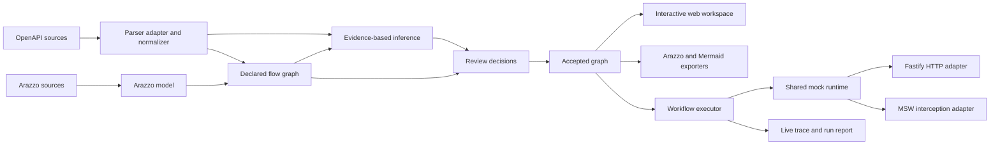

# API Schema Flow

> **Turn OpenAPI endpoint lists into visual, executable, and stateful API workflows.**

API Schema Flow is an open-source, local-first workbench for understanding how HTTP APIs work together. The long-term product imports OpenAPI descriptions, renders API dependencies as an interactive topology, helps users review evidence-based flow suggestions, exports standard Arazzo workflows, and runs those workflows against a stateful mock runtime.

> Project status: **pre-alpha**. The repository now contains the M0 foundation, M1 OpenAPI ingestion core, M2-A Arazzo core, M2-B declared flow graph foundation, and M2-C evidence-based inference core. The working `validate` command auto-detects OpenAPI or Arazzo, and `infer` generates deterministic review candidates from OpenAPI. Review decisions, the visual workspace, stateful mock runtime, workflow execution, and exporters remain on the roadmap. No npm package is published yet.

## What works today

The current implementation provides:

- a pnpm and Turborepo TypeScript monorepo with strict package boundaries;
- parser-independent domain, diagnostic, redaction, project-config, source-loader, OpenAPI, Arazzo, Flow, Inference, and CLI packages;
- policy-controlled local and HTTPS source loading with path, symlink, protocol, DNS/IP, redirect, timeout, size, document-count, and reference-depth limits;
- deterministic OpenAPI 3.0/3.1 normalization, OpenAPI 3.2 compatibility diagnostics, multi-file `$ref` graphs, fingerprints, and Link Objects;
- Arazzo 1.1.x JSON/YAML parsing, preservation, semantic validation, typed Runtime Expression ASTs, dependency analysis, source URI resolution, abstract operation binding, and support analysis;
- a versioned declared graph that projects OpenAPI Links and Arazzo workflows into endpoint nodes, workflow-step nodes, control edges, dependency edges, and structural data mappings;
- deterministic node, edge, mapping, graph, and inference-candidate identities with source provenance and cross-standard declaration merging;
- a conservative evidence-based inference engine with bounded structural indexing, hard blockers, explainable scoring, confidence bands, declared-edge suppression, Top-K ranking, benchmark metrics, and no automatic acceptance;
- `schema-flow validate <file-or-url> [--json]`, which auto-detects OpenAPI or Arazzo;
- `schema-flow infer <openapi-file-or-url> [--json]`, which composes OpenAPI ingestion, the declared operation graph, and inference candidates;
- structured diagnostics, stable source pointers, secret-safe output, and stable exit codes;
- parser-backed OpenAPI, Arazzo, declared-flow, and inference fixtures with unit, integration, conformance, security, performance, benchmark, and boundary tests;
- frozen-lockfile GitHub Actions verification.

## Run the current vertical slice

Requirements:

- Node.js 24
- pnpm 11

```bash
corepack enable
pnpm install --frozen-lockfile
pnpm build

node packages/cli/bin/schema-flow.mjs \
  validate examples/reservation/openapi.yaml
```

Machine-readable validation output:

```bash
node packages/cli/bin/schema-flow.mjs \
  validate examples/reservation/openapi.yaml \
  --json
```

Validate the canonical Arazzo workflow:

```bash
node packages/cli/bin/schema-flow.mjs \
  validate examples/reservation/arazzo.yaml
```

Generate evidence-based dependency candidates from OpenAPI:

```bash
node packages/cli/bin/schema-flow.mjs \
  infer fixtures/inference/cli/openapi.yaml
```

Machine-readable inference output:

```bash
node packages/cli/bin/schema-flow.mjs \
  infer fixtures/inference/cli/openapi.yaml \
  --json
```

Inference tuning flags include `--minimum-confidence <0..1>`, `--top-k <n>`, `--max-candidates <n>`, and `--include-low`. The command also accepts the existing source-policy flags such as `--allow-path`, `--allow-http`, `--allow-private-network`, and retrieval-budget limits.

Run the repository quality gates:

```bash
pnpm ci:verify
pnpm test:flow-fixtures
pnpm test:inference-benchmark
pnpm test:inference-performance
```

A successful OpenAPI validation currently reports:

```text
API Schema Flow

✓ OpenAPI document loaded
✓ OpenAPI 3.1.0 detected
✓ 4 operations normalized
✓ 6 schemas discovered
✓ 0 errors
✓ 0 warnings

Validation completed successfully.
```

A successful Arazzo validation reports:

```text
API Schema Flow

✓ Arazzo document loaded
✓ Arazzo 1.1.0 detected
✓ 1 workflows normalized
✓ 4 steps inspected
Support: supported
✓ 1 sources loaded
✓ 0 errors
✓ 0 warnings

Validation completed successfully.
```

Inference output reports candidate counts, confidence bands, evaluated and blocked pairs, declared suppressions, evidence rule IDs, diagnostics, and deterministic candidate data. Every emitted result remains `provenance: inferred` and `status: candidate` until a future review-decision layer accepts, rejects, or edits it.

## Why this project exists

OpenAPI is excellent at describing individual operations, but teams still struggle to answer workflow-level questions:

- Which response field becomes the next request parameter?
- Which endpoints participate in login, booking, checkout, or retry flows?
- What breaks when an API field changes?
- How can frontend and QA teams exercise a realistic sequence before the backend is ready?

API Schema Flow adds an executable workflow layer without replacing OpenAPI.

## Capability status

| Capability | Current repository | MVP direction |
|---|---|---|
| OpenAPI import | Local/HTTPS YAML and JSON, policy-controlled multi-file `$ref`, deterministic fingerprints | Broader public conformance corpus and browser-specific source adapters |
| OpenAPI normalization | Stable IDs, source pointers, schemas, security, servers, Link Objects, compatibility and ambiguity diagnostics | Continue feeding normalized fields into flow and inference layers |
| Arazzo core | Arazzo 1.1.x parse/preserve, semantic validation, Runtime Expression AST, DAG analysis, URI and abstract operation resolution, support profile | Editing, export round-trip, and supported-subset execution |
| Declared flow graph | OpenAPI Links and Arazzo step order, `dependsOn`, and Runtime Expression mappings become versioned declared/accepted graphs | Shared input for inference, review UI, export, execution, and change impact |
| Evidence-based inference | Deterministic candidate generation with blockers, evidence, scoring, confidence bands, stable IDs, declared suppression, benchmarks, and performance budgets | Review decisions, edited mappings, persistence, invalidation, and accepted inferred/manual edges |
| CLI | `validate <file-or-url> [--json]` and `infer <openapi-file-or-url> [--json]` | `open`, `review`, `mock`, `run`, and `export` planned |
| Visual topology | Design specifications and concept mockups only | React Flow nodes and edges with ELK layered layout |
| Dependency discovery | Declared relationships and evidence-based inferred candidates are implemented; candidates are never auto-accepted | Human review, decision persistence, and accepted graph materialization |
| Stateful mocking | Not implemented | In-memory CRUD lifecycle, deterministic seed, session isolation, reset, and snapshot |
| Workflow execution | Not implemented | Synchronous OpenAPI steps, mappings, outputs, criteria, timeout, and bounded retry |
| Live trace and export | Not implemented | Live trace, Arazzo, Mermaid, project JSON, and execution reports |
| Change impact | Post-MVP | Flow-aware OpenAPI diff and GitHub integration |

## Target experience

The intended product experience remains:

```bash
# Planned CLI UX; the npm package has not been published.
npx schema-flow open ./openapi.yaml
```

The command is expected to open a local web workspace where a developer can:

1. inspect endpoint nodes and schemas;
2. review declared and inferred dependencies;
3. accept, reject, or edit field mappings;
4. export a standards-based Arazzo workflow;
5. start an isolated stateful mock session;
6. execute the workflow and inspect a live trace.

## What makes it different

API Schema Flow does not treat every generated edge as truth. Each connection records its origin and evidence:

- **Declared** — imported from Arazzo or an OpenAPI Link Object.
- **Manual** — explicitly created or edited by a user.
- **Inferred** — proposed by deterministic matching rules with a confidence score and evidence breakdown.
- **Observed** — reserved for future evidence from traces or captured traffic.

M2-B produces only declared, accepted edges. M2-C produces only inferred candidates: it applies hard safety constraints, caps weak generic-ID evidence below visible confidence, and never converts a candidate into accepted graph truth automatically.

## Architecture at a glance



The implemented core keeps framework and parser details behind package-owned boundaries. Domain, diagnostics, redaction, config, source loading, OpenAPI normalization, Arazzo normalization, declared graph projection, evidence-based inference, and CLI orchestration can evolve independently of future React, Fastify, MSW, and ELK adapters. OpenAPI and Arazzo remain mutually independent parser packages; `@api-schema-flow/flow` composes declared standards, while `@api-schema-flow/inference` consumes normalized OpenAPI plus the declared operation graph without depending on UI, server, mock, or execution runtimes.

## Current repository layout

```text
packages/
  domain/
  diagnostics/
  redaction/
  config/
  source-loader/
  openapi/
  arazzo/
  flow/
  inference/
  cli/
examples/
  reservation/
fixtures/
  openapi/
  arazzo/
  flow/
  inference/
docs/
  adr/
  design/
  reports/
  spikes/
  superpowers/specs/
  superpowers/plans/
tooling/
.github/workflows/
```

See [Repository Structure](docs/22-REPOSITORY-STRUCTURE.md) for the complete planned package map and dependency rules.

## Standards baseline

The design baseline was reviewed on **2026-09-01**:

- OpenAPI Specification 3.2.0 is the latest published OAS version recorded by the project documentation.
- Arazzo Specification 1.1.0 is the latest published Arazzo version recorded by the project documentation.
- MVP execution will support a documented subset instead of claiming full Arazzo or AsyncAPI execution conformance.

See [Standards Baseline](docs/28-STANDARDS-BASELINE.md).

## Product boundaries

API Schema Flow is not intended to be:

- a full replacement for Postman or an API management gateway;
- a production traffic proxy;
- an arbitrary JavaScript execution environment;
- an automatic source of business truth from OpenAPI alone;
- a hosted collaboration platform in the MVP.

## Documentation

Start with the [Documentation Index](docs/00-DOCUMENT-INDEX.md).

Key documents:

- [Product Requirements Document](docs/02-PRD.md)
- [MVP Scope and Acceptance](docs/03-MVP-SCOPE-AND-ACCEPTANCE.md)
- [System Architecture](docs/06-SYSTEM-ARCHITECTURE.md)
- [OpenAPI Ingestion Specification](docs/08-OPENAPI-INGESTION-SPEC.md)
- [Arazzo Workflow Specification](docs/09-ARAZZO-WORKFLOW-SPEC.md)
- [Flow Inference Specification](docs/10-FLOW-INFERENCE-SPEC.md)
- [CLI Specification](docs/14-CLI-SPEC.md)
- [Security Threat Model](docs/19-SECURITY-THREAT-MODEL.md)
- [Test Strategy](docs/20-TEST-STRATEGY.md)
- [M0/M1-A Implementation Plan](docs/superpowers/plans/2026-09-01-m0-m1a-foundation.md)
- [M1-B Ingestion Hardening Plan](docs/superpowers/plans/2026-09-01-m1b-ingestion-hardening.md)
- [M2-A Arazzo Core Plan](docs/superpowers/plans/2026-09-01-m2a-arazzo-core.md)
- [M2-B Declared Flow Graph Design](docs/superpowers/specs/2026-09-02-m2b-declared-flow-graph-design.md)
- [M2-B Declared Flow Graph Plan](docs/superpowers/plans/2026-09-02-m2b-declared-flow-graph.md)
- [M2-C Evidence-Based Inference Design](docs/superpowers/specs/2026-09-02-m2c-inference-core-design.md)
- [M2-C Evidence-Based Inference Plan](docs/superpowers/plans/2026-09-02-m2c-inference-core.md)

Traditional Chinese: [README.zh-TW.md](README.zh-TW.md)

## Contributing

The project uses small, reviewable pull requests, Conventional Commits, strict TypeScript, fixture-based standards tests, and package-boundary verification. See [CONTRIBUTING.md](CONTRIBUTING.md).

## Security and privacy

The project is local-first and sends no telemetry by default. Remote OpenAPI sources are acquired only through the M1-B retrieval policy: HTTPS and public-network addresses by default, canonical local roots, manual redirect validation, bounded resources, and no implicit credentials. OpenAPI, Arazzo, Flow, and Inference diagnostics are redacted before reaching external output. Declared graph and inference artifacts store structural selectors, evidence, confidence, and source pointers rather than runtime secret values, schema examples, or defaults. See [SECURITY.md](SECURITY.md) and the [Threat Model](docs/19-SECURITY-THREAT-MODEL.md).

## License

Licensed under the [Apache License 2.0](LICENSE).
