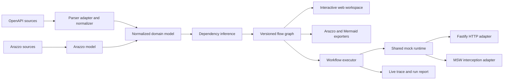

# API Schema Flow

> **Turn OpenAPI endpoint lists into visual, executable, and stateful API workflows.**

API Schema Flow is an open-source, local-first workbench for understanding how HTTP APIs work together. It imports OpenAPI descriptions, renders API dependencies as an interactive topology, helps users review evidence-based flow suggestions, exports standard Arazzo workflows, and runs those workflows against a stateful mock runtime.

> Project status: **pre-alpha / specification stage**. The commands below describe the intended MVP experience. No npm package is published yet.

## Why this project exists

OpenAPI is excellent at describing individual operations, but teams still struggle to answer workflow-level questions:

- Which response field becomes the next request parameter?
- Which endpoints participate in login, booking, checkout, or retry flows?
- What breaks when an API field changes?
- How can frontend and QA teams exercise a realistic sequence before the backend is ready?

API Schema Flow adds an executable workflow layer without replacing OpenAPI.

## Target experience

```bash
# Target CLI UX; package name is provisional until publication.
npx schema-flow open ./openapi.yaml
```

The command is expected to open a local workspace where a developer can:

1. inspect endpoint nodes and schemas;
2. review declared and inferred dependencies;
3. accept or edit field mappings;
4. export a standards-based Arazzo workflow;
5. start an isolated stateful mock session;
6. execute the workflow and inspect a live trace.

## Core capabilities

| Capability | MVP intent |
|---|---|
| OpenAPI import | OpenAPI 3.0.x and 3.1.x supported; 3.2.x handled as a compatibility profile |
| Workflow standard | Arazzo 1.1.x import, validation, visualization, and supported-subset execution |
| Visual topology | React Flow nodes and edges with ELK layered layout |
| Dependency discovery | Declared, manual, and evidence-based inferred edges |
| Stateful mocking | In-memory CRUD lifecycle, deterministic seed, session isolation, reset and snapshot |
| Workflow execution | Synchronous OpenAPI steps, inputs, mappings, outputs, criteria, timeout and bounded retry |
| Live trace | Step timing, request/response metadata, output extraction, state mutation and failures |
| Export | Arazzo, Mermaid, project JSON, and machine-readable execution reports |
| Change impact | Designed as a post-MVP flow-aware OpenAPI diff capability |

## What makes it different

API Schema Flow does not treat every generated edge as truth. Each connection records its origin and evidence:

- **Declared** — imported from Arazzo or an OpenAPI Link Object.
- **Manual** — explicitly created or edited by a user.
- **Inferred** — proposed by deterministic matching rules with a confidence score.
- **Observed** — reserved for future evidence from traces or captured traffic.

Inferred edges remain candidates until a user accepts them.

## Architecture at a glance



The domain model, inference engine, workflow executor, and mock runtime must not depend on React, Fastify, MSW, or a specific OpenAPI parser.

## Planned repository layout

```text
apps/
  web/
packages/
  domain/
  openapi/
  arazzo/
  inference/
  layout/
  mock-runtime/
  adapter-fastify/
  adapter-msw/
  execution/
  exporters/
  config/
  cli/
  ui/
  test-fixtures/
docs/
```

See [Repository Structure](docs/22-REPOSITORY-STRUCTURE.md) for package boundaries.

## Standards baseline

The design baseline was reviewed on **2026-09-01**:

- OpenAPI Specification 3.2.0 is the latest published OAS version.
- Arazzo Specification 1.1.0 is the latest published Arazzo version.
- MVP execution intentionally supports a documented subset instead of claiming full Arazzo or AsyncAPI execution conformance.

See [Standards Baseline](docs/28-STANDARDS-BASELINE.md).

## Product boundaries

API Schema Flow is not intended to be:

- a full replacement for Postman or an API management gateway;
- a production traffic proxy;
- an arbitrary JavaScript execution environment;
- an automatic source of business truth from OpenAPI alone;
- a hosted collaboration platform in the MVP.

## Documentation

Start with the [Documentation Index](docs/00-DOCUMENT-INDEX.md).

Key documents:

- [Product Requirements Document](docs/02-PRD.md)
- [MVP Scope and Acceptance](docs/03-MVP-SCOPE-AND-ACCEPTANCE.md)
- [System Architecture](docs/06-SYSTEM-ARCHITECTURE.md)
- [Flow Inference Specification](docs/10-FLOW-INFERENCE-SPEC.md)
- [Stateful Mock Runtime Specification](docs/11-STATEFUL-MOCK-RUNTIME-SPEC.md)
- [Web Application UX Specification](docs/13-WEB-APP-UX-SPEC.md)
- [Security Threat Model](docs/19-SECURITY-THREAT-MODEL.md)
- [Implementation Readiness Checklist](docs/30-IMPLEMENTATION-READINESS-CHECKLIST.md)

Traditional Chinese: [README.zh-TW.md](README.zh-TW.md)

## Contributing

The project will use small, reviewable pull requests, Conventional Commits, Changesets, strict TypeScript, fixture-based standards tests, and an evidence benchmark for inference quality. See [CONTRIBUTING.md](CONTRIBUTING.md).

## Security and privacy

The MVP is local-first and sends no telemetry by default. Remote references, URL imports, rendered Markdown, mock-server exposure, and secrets are treated as explicit trust-boundary concerns. See [SECURITY.md](SECURITY.md) and the [Threat Model](docs/19-SECURITY-THREAT-MODEL.md).

## License

The recommended default is **Apache License 2.0** because this is standards-oriented infrastructure and the explicit patent grant is useful for contributors and adopters. Final owner confirmation is recorded in [Open Decisions](docs/25-OPEN-DECISIONS.md) before the repository is made public.
