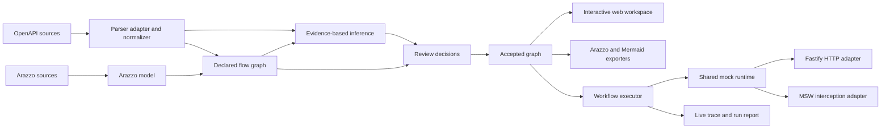

# API Schema Flow

> **Turn OpenAPI endpoint lists into visual, executable, and stateful API workflows.**

API Schema Flow is an open-source, local-first workbench for understanding how HTTP APIs work together. The long-term product imports OpenAPI descriptions, renders API dependencies as an interactive topology, helps users review evidence-based flow suggestions, exports standard Arazzo workflows, and runs those workflows against a stateful mock runtime.

> Project status: **pre-alpha**. M0–M2 and the M3 browser review, mapping editor, IndexedDB persistence, Project Save/Load, and local-file `open` CLI are implemented. This checkout adds task-focused exploration, a single-workflow Arazzo editor/exporter, and a narrow browser-local POST→GET Mock run with a redacted step Trace. Suggestions remain unaccepted until reviewed and explicitly selected. General workflow inputs, success criteria, timeout/retry, Mermaid preview, general CRUD mocking, real HTTP execution, and report export remain planned. No npm package is published yet; see [ROADMAP.md](ROADMAP.md) for delivery boundaries.

## What works today

The current implementation provides:

- a pnpm and Turborepo TypeScript monorepo with strict package boundaries;
- parser-independent Domain, Diagnostics, Redaction, Project Config, Source Loader, OpenAPI, Arazzo, Flow, Inference, Review, Arazzo Exporter, and CLI packages;
- policy-controlled local and HTTPS source loading with path, symlink, protocol, DNS/IP, redirect, timeout, size, document-count, and reference-depth limits;
- deterministic OpenAPI 3.0/3.1 normalization, OpenAPI 3.2 compatibility diagnostics, multi-file `$ref` graphs, fingerprints, and Link Objects;
- Arazzo 1.1.x JSON/YAML parsing, preservation, semantic validation, typed Runtime Expression ASTs, dependency analysis, source URI resolution, abstract operation binding, and support analysis;
- a versioned declared graph that projects OpenAPI Links and Arazzo workflows into endpoint nodes, workflow-step nodes, control edges, dependency edges, and structural data mappings;
- deterministic node, edge, mapping, graph, and inference-candidate identities with source provenance and cross-standard declaration merging;
- a conservative evidence-based inference engine with bounded structural indexing, hard blockers, explainable scoring, confidence bands, declared-edge suppression, Top-K ranking, benchmark metrics, and no automatic acceptance;
- immutable `accept`, `reject`, and `edit` review decisions with deterministic identity, revision supersession, stale/orphan reporting, and accepted inferred/manual edge materialization;
- explicit workflow plans and deterministic Arazzo 1.1 YAML/JSON export with canonical ordering, exact SHA-256 content hashes, parser self-validation, and no candidate/rejected edge leakage;
- `schema-flow validate <file-or-url> [--json]`, which auto-detects OpenAPI or Arazzo;
- `schema-flow infer <openapi-file-or-url> [--json]`, which composes OpenAPI ingestion, the declared operation graph, and inference candidates;
- `schema-flow review <openapi-file-or-url> --decisions <decision-set.json> [--json]`, which applies explicit decisions to an accepted-only operation graph;
- `schema-flow export-arazzo <openapi-file-or-url> --decisions <decision-set.json> --workflow <workflow-plan.json>`, which emits the explicitly ordered accepted subset as Arazzo;
- structured diagnostics, stable source pointers, secret-safe output, and stable exit codes;
- parser-backed OpenAPI, Arazzo, declared-flow, inference, review, and export fixtures with unit, integration, conformance, security, performance, benchmark, Golden, and boundary tests;
- frozen-lockfile GitHub Actions verification.
- a task-focused browser workspace with an API overview, grouped pending suggestions, search and tag filters, a focused endpoint neighborhood, resolved schema inspection, review decisions, and project persistence.

## Try the browser review workspace

The interface defaults to Traditional Chinese. Select English from the language menu in the top bar; the browser remembers your preference. Switching languages preserves decisions and layout. API paths, field names, source content, and exported data keep their original values. The instructions below use the English labels.

**Decisions auto-save to IndexedDB. Wait for Saved locally before closing. Import/export uses the same Decision Set JSON format as the CLI.**

After installing dependencies and building the workspace packages:

```bash
pnpm install --frozen-lockfile
pnpm build
pnpm dev:web
```

Open the local URL printed by Vite, normally `http://localhost:5173`. The welcome screen offers the bundled Reservation sample; use the local import command below to open your own specification.

Start in **Topology** or **Outline** to see the API overview. Select a suggested source-to-target handoff to inspect its evidence in **Inference Review**, or choose **Review all suggestions**. Dashed amber lines group pending mappings between endpoints; confirmed relationships use their own style and counts. Use the tag filter and search to narrow the list, select an endpoint to inspect its requests, responses, security, and resolved schema fields, then focus its direct neighbors. Candidate previews never accept a relationship or change the exported Decision Set.

1. Select **Inference Review** in the left navigation. Use search, confidence, and review-state filters to find a candidate.
2. Set **Review state → All** to include the snapshot's existing decisions. Select the candidate from `POST /auth/login` to `GET /spaces/available`.
3. Inspect **Mapping preview** and **Evidence Inspector**. Evidence is open by default; **Hide evidence**, **Show evidence**, and Escape control its visibility.
4. This fixture already accepts the login candidate. Choose **Reject**, select a reason, and confirm to remove its inferred edge from the draft. **Other** requires a nonblank note. Declared edges remain unchanged.
5. Select the same candidate again and choose **Accept** to restore its inferred edge. Switch to **Topology preview** to inspect the draft graph. Candidates with blockers or invalid/stale/conflicting state cannot be accepted.
6. Use **Undo latest change** to reverse one draft action at a time. Reload to restore locally saved decisions. Review actions never modify the source snapshot or CLI decision files.

For M3-B2, select **Review state → All**, choose `GET /spaces/available → POST /reservations`, and open **Edit Mapping**. Select `Response #/*/id` and `Body #/spaceId`, explicitly enter an array index such as `0`, then **Apply mapping**. The draft gains a manual accepted edge. **Cancel** changes nothing; **Undo latest change** restores the previous mapping. Reopening the editor uses the current effective mapping.

The two-column schema field lists validate scalar types, required values, formats, enums, nullability, and explicit array indices. Literal templates allow exactly one `{$value}` placeholder; examples and runtime expressions are previews, never executable scripts. Sensitive examples are redacted. Supported sources are response-body fields; targets are path/query/header parameters and request-body fields. Ambiguous unions, unresolved schemas, read-only targets, and incompatible mappings cannot be applied. JSONPath, arbitrary transforms, and switching the candidate's operations are excluded. Arazzo hints describe mapping shape only; workflow binding and ordering still require CLI validation.

Local persistence is scoped to the project fingerprint and source revision. Semantic decisions and Undo history are restored; view filters and selection are not persisted. **Import Decision Set** validates the file and shows the merged outcomes before **Apply import**; Cancel preserves current decisions. **Export Decision Set** downloads deterministic JSON without browser metadata. Reimporting the same file is idempotent; stale identities and conflicting revisions remain visible through Review core.

**Clear saved data** confirms removal of saved decisions and layout for the current project/source and disables autosave across reloads. Current in-memory decisions remain exportable; only a versioned disabled preference and generation marker remain stored to prevent older tabs from writing decisions back. **Enable autosave** resumes saving the current session.

Storage errors leave the current session usable for export. **Back up stored data** downloads the original record; **Reset saved data** requires confirmation and affects only the current project/source key. **Reload saved data** replaces the current local session with the saved version, so export unsaved decisions first. Concurrent tabs use generation checks and cannot silently overwrite one another. Stored records include schema and tool versions. Storage payload version 2 includes layout; version 1 records remain readable with default layout and are rewritten only on the next user change. The IndexedDB store remains database version 1; unknown versions or changed baselines are preserved for recovery, not automatically migrated or overwritten.

**Project → Save Project** downloads a deterministic `schema-flow-project.json` containing the current source fingerprint/revision, decisions, Undo history, and separate topology/review layout data. This file is distinct from the CLI configuration and Decision Set formats. It references the currently loaded source and does not embed source documents or load URLs.

**Load Project** validates the complete file, then previews replacement. **Apply project** replaces decisions and both layouts together; **Cancel load** leaves the current project unchanged. Save a backup before replacing the current session. Different source fingerprints/revisions, changed baselines, unknown versions, invalid node IDs/coordinates, and files over 5 MB are rejected without modifying the workspace. Open the same local source with the same content before loading its project file.

Drag nodes or pan/zoom either canvas to save its positions and viewport locally. Horizontal/Vertical changes rearrange both canvases; selecting the current direction keeps manual layout. **Project → Reset layout** restores automatic layout without changing decisions. **Save Project** works with autosave disabled; loading a project keeps the existing autosave preference. Versioned layout contains stable IDs and finite coordinates only, never React Flow or ELK objects. Windows and Linux visual baselines cover both desktop sizes; ordinary PR CI verifies the committed baselines before merge.

Keyboard support includes Tab, candidate-list Arrow/Home/End navigation, Enter/Space selection, `/` for search, Escape to close evidence/dialogs, and keyboard scrolling of mapping details. Desktop validation covers 1440 × 900 and 1366 × 768; mobile and other browser engines are not yet validated.

Browser gates: `pnpm test:web`, `pnpm check:review-browser-bundle`, `pnpm build:web`, `pnpm check:web-bundle`, and `pnpm test:web:e2e`. Install Chromium first with `pnpm --filter @api-schema-flow/web exec playwright install chromium` if needed.

## Run the current vertical slice

Requirements:

- Node.js 24
- pnpm 11

```bash
corepack enable
pnpm install --frozen-lockfile
pnpm build

node packages/cli/bin/schema-flow.mjs \
  validate examples/reservation/openapi.yaml
```

Machine-readable validation output:

```bash
node packages/cli/bin/schema-flow.mjs \
  validate examples/reservation/openapi.yaml \
  --json
```

Validate the canonical Arazzo workflow:

```bash
node packages/cli/bin/schema-flow.mjs \
  validate examples/reservation/arazzo.yaml
```

Generate evidence-based dependency candidates from OpenAPI:

```bash
node packages/cli/bin/schema-flow.mjs \
  infer fixtures/inference/cli/openapi.yaml
```

Machine-readable inference output:

```bash
node packages/cli/bin/schema-flow.mjs \
  infer fixtures/inference/cli/openapi.yaml \
  --json
```

Inference tuning flags include `--minimum-confidence <0..1>`, `--top-k <n>`, `--max-candidates <n>`, and `--include-low`. The command also accepts the existing source-policy flags such as `--allow-path`, `--allow-http`, `--allow-private-network`, and retrieval-budget limits.

Apply the canonical review decisions and inspect the accepted graph:

```bash
node packages/cli/bin/schema-flow.mjs \
  review fixtures/review/reservation/openapi.yaml \
  --decisions fixtures/review/reservation/decision-set.json \
  --json
```

Export the explicitly ordered accepted subset as canonical Arazzo YAML:

```bash
node packages/cli/bin/schema-flow.mjs \
  export-arazzo fixtures/review/reservation/openapi.yaml \
  --decisions fixtures/review/reservation/decision-set.json \
  --workflow fixtures/review/reservation/workflow-plan.json \
  --format yaml
```

Use `--output <path>` to write an artifact. Existing files are not overwritten unless `--force` is explicitly supplied. JSON export uses `--format json`; `--json` instead requests a machine-readable CLI report.

Run the repository quality gates:

```bash
pnpm ci:verify
pnpm test:flow-fixtures
pnpm test:inference-benchmark
pnpm test:inference-performance
pnpm test:review
pnpm test:export-arazzo
pnpm test:review-export-fixtures
```

A successful OpenAPI validation currently reports:

```text
API Schema Flow

✓ OpenAPI document loaded
✓ OpenAPI 3.1.0 detected
✓ 4 operations normalized
✓ 6 schemas discovered
✓ 0 errors
✓ 0 warnings

Validation completed successfully.
```

A successful Arazzo validation reports:

```text
API Schema Flow

✓ Arazzo document loaded
✓ Arazzo 1.1.0 detected
✓ 1 workflows normalized
✓ 4 steps inspected
Support: supported
✓ 1 sources loaded
✓ 0 errors
✓ 0 warnings

Validation completed successfully.
```

Inference output reports candidate counts, confidence bands, evaluated and blocked pairs, declared suppressions, evidence rule IDs, diagnostics, and deterministic candidate data. Every emitted inference result remains `provenance: inferred` and `status: candidate`. M2-D changes authoritative graph state only through an explicit valid decision: `accept` becomes `inferred + accepted`, `edit` becomes `manual + accepted`, and `reject`, stale, orphaned, superseded, conflicting, or invalid decisions create no edge.

## Why this project exists

OpenAPI is excellent at describing individual operations, but teams still struggle to answer workflow-level questions:

- Which response field becomes the next request parameter?
- Which endpoints participate in login, booking, checkout, or retry flows?
- What breaks when an API field changes?
- How can frontend and QA teams exercise a realistic sequence before the backend is ready?

API Schema Flow adds an executable workflow layer without replacing OpenAPI.

## Capability status

| Capability | Current repository | MVP direction |
|---|---|---|
| OpenAPI import | Local/HTTPS YAML and JSON, policy-controlled multi-file `$ref`, deterministic fingerprints | Broader public conformance corpus and browser-specific source adapters |
| OpenAPI normalization | Stable IDs, source pointers, schemas, security, servers, Link Objects, compatibility and ambiguity diagnostics | Continue feeding normalized fields into flow and inference layers |
| Arazzo core | Arazzo 1.1.x parse/preserve, semantic validation, Runtime Expression AST, DAG analysis, URI and abstract operation resolution, support profile | Visual editing and supported-subset execution |
| Declared flow graph | OpenAPI Links and Arazzo step order, `dependsOn`, and Runtime Expression mappings become versioned declared/accepted graphs | Shared input for inference, review UI, export, execution, and change impact |
| Evidence-based inference | Deterministic candidates and core accept/reject/edit decisions; the browser creates Accept/Reject/Edit drafts | Cross-source project migration |
| CLI | `validate`, `infer`, `review`, `export-arazzo`, and local-file `open` are implemented | `mock`, `run`, Mermaid export, and report export planned |
| Visual topology | React Flow/ELK topology and outline with grouped pending handoffs, search/tag/focus, and resolved schema inspection | Larger workflow visualization and Mermaid preview |
| Dependency discovery | Evidence, Accept/Reject, Undo, draft topology, and M3-B2 mapping editing; candidates are never auto-accepted | Additional workflow authoring |
| Browser workflow editor | Ordered endpoint steps, selected accepted data bindings, parser-validated Arazzo YAML/JSON preview and download; draft survives Project save/load and IndexedDB reload | Workflow inputs, success criteria, timeout/retry, and multiple workflows |
| Stateful mocking | Browser-local POST collection creation, GET-by-id lookup, session isolation, and reset | General CRUD, deterministic seed, snapshot, and HTTP adapter |
| Workflow execution | Two-step local POST→GET run using an accepted `id` binding and request schema checks | General mappings, criteria, timeout, bounded retry, and real HTTP execution |
| Live trace and export | Step-by-step local Trace, deterministic Arazzo 1.1 YAML/JSON export, and browser Project JSON save/load | Streaming Trace, Mermaid, and execution reports |
| Change impact | Post-MVP | Flow-aware OpenAPI diff and GitHub integration |

## Target experience

The intended product experience remains:

```bash
# Planned CLI UX; the npm package has not been published.
npx schema-flow open ./openapi.yaml
```

The command is expected to open a local web workspace where a developer can:

1. inspect endpoint nodes and schemas;
2. review declared and inferred dependencies;
3. accept, reject, or edit field mappings;
4. export a standards-based Arazzo workflow;
5. start an isolated stateful mock session;
6. execute the workflow and inspect a live trace.

## What makes it different

API Schema Flow does not treat every generated edge as truth. Each connection records its origin and evidence:

- **Declared** — imported from Arazzo or an OpenAPI Link Object.
- **Manual** — explicitly created or edited by a user.
- **Inferred** — proposed by deterministic matching rules with a confidence score and evidence breakdown.
- **Observed** — reserved for future evidence from traces or captured traffic.

M2-B produces only declared, accepted edges. M2-C produces only inferred candidates: it applies hard safety constraints, caps weak generic-ID evidence below visible confidence, and never converts a candidate into accepted graph truth automatically. M2-D adds the explicit human decision boundary, materializes accepted inferred/manual edges, and exports only an explicitly ordered accepted subset to Arazzo.

## Architecture at a glance



The implemented core keeps framework and parser details behind package-owned boundaries. Domain, diagnostics, redaction, config, source loading, OpenAPI normalization, Arazzo normalization, declared graph projection, evidence-based inference, review materialization, deterministic Arazzo export, and CLI orchestration can evolve independently of future React, Fastify, MSW, and ELK adapters. OpenAPI and Arazzo remain mutually independent parser packages; `@api-schema-flow/flow` composes declared standards, `@api-schema-flow/inference` proposes candidates, `@api-schema-flow/review` applies explicit decisions, and `@api-schema-flow/exporter-arazzo` serializes only accepted graph truth.

## Current repository layout

```text
apps/
  web/
packages/
  domain/
  diagnostics/
  redaction/
  config/
  source-loader/
  openapi/
  arazzo/
  flow/
  inference/
  review/
  exporter-arazzo/
  layout/
  cli/
examples/
  reservation/
fixtures/
  openapi/
  arazzo/
  flow/
  inference/
  review/
docs/
  adr/
  design/
  reports/
  spikes/
  superpowers/specs/
  superpowers/plans/
tooling/
.github/workflows/
```

See [Repository Structure](docs/22-REPOSITORY-STRUCTURE.md) for the complete planned package map and dependency rules.

## Standards baseline

The design baseline was reviewed on **2026-09-01**:

- OpenAPI Specification 3.2.0 is the latest published OAS version recorded by the project documentation.
- Arazzo Specification 1.1.0 is the latest published Arazzo version recorded by the project documentation.
- MVP execution will support a documented subset instead of claiming full Arazzo or AsyncAPI execution conformance.

See [Standards Baseline](docs/28-STANDARDS-BASELINE.md).

## Product boundaries

API Schema Flow is not intended to be:

- a full replacement for Postman or an API management gateway;
- a production traffic proxy;
- an arbitrary JavaScript execution environment;
- an automatic source of business truth from OpenAPI alone;
- a hosted collaboration platform in the MVP.

## Documentation

Start with the [Documentation Index](docs/00-DOCUMENT-INDEX.md).

Key documents:

- [Product Requirements Document](docs/02-PRD.md)
- [MVP Scope and Acceptance](docs/03-MVP-SCOPE-AND-ACCEPTANCE.md)
- [System Architecture](docs/06-SYSTEM-ARCHITECTURE.md)
- [OpenAPI Ingestion Specification](docs/08-OPENAPI-INGESTION-SPEC.md)
- [Arazzo Workflow Specification](docs/09-ARAZZO-WORKFLOW-SPEC.md)
- [Flow Inference Specification](docs/10-FLOW-INFERENCE-SPEC.md)
- [CLI Specification](docs/14-CLI-SPEC.md)
- [Security Threat Model](docs/19-SECURITY-THREAT-MODEL.md)
- [Test Strategy](docs/20-TEST-STRATEGY.md)
- [M0/M1-A Implementation Plan](docs/superpowers/plans/2026-09-01-m0-m1a-foundation.md)
- [M1-B Ingestion Hardening Plan](docs/superpowers/plans/2026-09-01-m1b-ingestion-hardening.md)
- [M2-A Arazzo Core Plan](docs/superpowers/plans/2026-09-01-m2a-arazzo-core.md)
- [M2-B Declared Flow Graph Design](docs/superpowers/specs/2026-09-02-m2b-declared-flow-graph-design.md)
- [M2-B Declared Flow Graph Plan](docs/superpowers/plans/2026-09-02-m2b-declared-flow-graph.md)
- [M2-C Evidence-Based Inference Design](docs/superpowers/specs/2026-09-02-m2c-inference-core-design.md)
- [M2-C Evidence-Based Inference Plan](docs/superpowers/plans/2026-09-02-m2c-inference-core.md)
- [M2-D Review and Arazzo Export Design](docs/superpowers/specs/2026-09-03-m2d-review-arazzo-export-design.md)
- [M2-D Review and Arazzo Export Plan](docs/superpowers/plans/2026-09-03-m2d-review-arazzo-export.md)
- [M2-D Verification Report](docs/reports/m2d-review-arazzo-export-verification.md)

Traditional Chinese: [README.zh-TW.md](README.zh-TW.md)

## Contributing

The project uses small, reviewable pull requests, Conventional Commits, strict TypeScript, fixture-based standards tests, and package-boundary verification. See [CONTRIBUTING.md](CONTRIBUTING.md).

## Security and privacy

The project is local-first and sends no telemetry by default. Remote OpenAPI sources are acquired only through the M1-B retrieval policy: HTTPS and public-network addresses by default, canonical local roots, manual redirect validation, bounded resources, and no implicit credentials. OpenAPI, Arazzo, Flow, Inference, Review, and Export diagnostics are redacted before reaching external output. Declared and reviewed graph artifacts store structural selectors, evidence identifiers, and source pointers rather than runtime secret values. Candidate, rejected, stale, orphaned, superseded, and invalid decisions never enter Arazzo output; source URLs containing credentials and credential-shaped generated values are blocked. See [SECURITY.md](SECURITY.md) and the [Threat Model](docs/19-SECURITY-THREAT-MODEL.md).

## License

Licensed under the [Apache License 2.0](LICENSE).

## Open a local OpenAPI workspace

The first visit to the web root offers a clearly labeled Reservation sample. For a richer import demonstration, the repository also includes the entirely fictional [Example Commerce OpenAPI file](examples/demo-commerce/openapi.yaml). No work-project specification is bundled. The npm package is not published yet. After `pnpm install --frozen-lockfile` and `pnpm build`, run from the repository root:

```bash
node packages/cli/bin/schema-flow.mjs open examples/demo-commerce/openapi.yaml --port 4318
```

Open the complete printed URL in Chrome or Edge, including its `#workspace=…` fragment. Keep the process running. To inspect a different API, replace the demo file path with your own local OpenAPI file. This source-checkout command accepts local JSON/YAML and local references beneath the source directory. It does not call business APIs or fetch remote references. The read-only server binds only to `127.0.0.1`; its private snapshot requires a per-launch token. Do not share that URL. Normalized examples/defaults are omitted, but schema descriptions and source paths can still be private: keep private specifications and exports outside public repositories.

1. In **Inference Review**, inspect evidence and use **Edit Mapping** or Accept/Reject. Candidate scores do not prove business correctness; nullable/required/type checks can block an edit.
2. In **Workflows**, create a draft, add the API operations in order, and explicitly select accepted mappings between those steps. Set the OpenAPI source URL or a relative file path, then **Validate and preview → Download Arazzo**. This exports a document; it does not invoke the API.
3. Wait for **Saved locally**, then use **Project → Save Project** for a portable backup of decisions, Undo history, layout, and the workflow draft. The source itself is not embedded; keep the original specification.
4. Reload to restore IndexedDB state in the same browser. After stopping the CLI, the old token URL expires; rerun `open` with the same source and port and use the new URL. To reopen a Project JSON backup, pass the same source version and the backup together:

   ```bash
   node packages/cli/bin/schema-flow.mjs open /absolute/path/openapi.json --project /absolute/path/schema-flow-project.json --port 4318
   ```

   The browser previews the project and replaces current state only after **Apply project**. Save a backup first if you already have a local draft for that source.
5. **Export Decision Set** downloads CLI-compatible review decisions separately. **Local Mock** executes only the supported two-step POST→GET flow in memory; its Trace is not saved in the Project and no business API is called.

Source acquisition retains the default 5 MiB per-document and 20 MiB aggregate limits; Project JSON is limited to 5 MiB and normalized workspace responses to 64 MiB. Inference retains bounded pair/depth budgets and displays diagnostics, so candidates may be incomplete. Time-truncated inference is rejected to keep saved sessions reproducible. Specifications above 200 operations open in Outline. The group browser narrows to a meaningful scope and switches to Topology when that group has at most 200 endpoints. Large lists initially render 80 sidebar rows and 100 Outline rows, with explicit Load more controls; this changes only the rendered rows, not the search/filter data scope. Focusing a selected endpoint shows its direct confirmed and pending neighbors and clearing focus restores the previous filters. Topology is still limited to 200 endpoints, and the 500-node canvas performance target remains unmet. The review draft canvas is disabled above the limit; mapping and summary remain available. This is local import and limited Mock execution, not live HTTP execution or a production-readiness claim.
