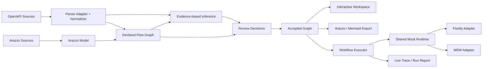

# API Schema Flow

> **將 OpenAPI 的端點清單，轉換成可視化、可執行、可模擬的 API 工作流程。**

API Schema Flow 是一套開源、Local-first 的 API Workflow Workbench。長期產品會匯入 OpenAPI 規格、以互動式拓撲呈現 API 依賴、協助使用者審核有證據的流程推導、輸出標準 Arazzo 工作流，並透過具備狀態的 Mock Runtime 執行整段流程。

> 專案狀態：**Pre-alpha**。M0～M2，以及 M3 的瀏覽器審查、欄位映射編輯、IndexedDB 持久化、Project Save/Load 與 CLI 本機檔案 `open` 已實作。此工作目錄新增以任務為中心的探索、單一工作流程編輯與 Arazzo YAML／JSON 匯出，以及本機 Mock 的 POST→GET 執行和 Trace。候選關係仍須人工審查，並在工作流程中明確選取。完整的工作流程輸入、成功條件、Timeout／Retry、Mermaid 預覽、通用 CRUD Mock、正式 HTTP 執行及報告匯出尚未完成。尚未發布 npm 套件；交付界線見 [ROADMAP.md](ROADMAP.md)。

## 現在已經能做什麼？

目前版本已具備：

- pnpm、Turborepo 與 TypeScript Strict Monorepo；
- Parser-independent 的 Domain、Diagnostics、Redaction、Project Config、Source Loader、OpenAPI、Arazzo、Flow、Inference、Review、Arazzo Exporter 與 CLI Package；
- 受 Policy 控制的本機與 HTTPS Source Loading，包含路徑、Symlink、Protocol、DNS/IP、Redirect、Timeout、大小、文件數量與 Reference Depth 限制；
- OpenAPI 3.0／3.1 決定性 Normalization、3.2 Compatibility Diagnostic、Multi-file `$ref` Graph、Fingerprint 與 Link Object；
- Arazzo 1.1.x JSON／YAML Parse／Preserve、Semantic Validation、Typed Runtime Expression AST、Dependency Analysis、Source URI Resolution、抽象 Operation Binding 與 Support Analysis；
- 將 OpenAPI Link 與 Arazzo Workflow 轉換成版本化 Declared Graph，包括 Endpoint Node、Workflow Step Node、Control Edge、Dependency Edge 與 Structural Data Mapping；
- 決定性的 Node、Edge、Mapping、Graph 與 Inference Candidate ID，並保留 Source Provenance 與跨標準宣告合併資訊；
- 保守的 Evidence-based Inference Engine，具備有界 Structural Index、Hard Blocker、可解釋 Scoring、Confidence Band、Declared-edge Suppression、Top-K Ranking、Benchmark Metrics，且永不自動接受 Candidate；
- Immutable 的 `accept`、`reject`、`edit` Review Decision，支援決定性 Identity、Revision Supersession、Stale／Orphaned 說明，以及 Accepted Inferred／Manual Edge Materialization；
- 明確 Workflow Plan 與決定性 Arazzo 1.1 YAML／JSON Export，具備 Canonical Ordering、精確 SHA-256 Content Hash、Parser Self-validation，且不會輸出 Candidate／Rejected Edge；
- 可自動辨識 OpenAPI 或 Arazzo 的 `schema-flow validate <file-or-url> [--json]`；
- 可組合 OpenAPI Ingestion、Declared Operation Graph 與 Inference 的 `schema-flow infer <openapi-file-or-url> [--json]`；
- 以 Decision Set 產生 Accepted-only Graph 的 `schema-flow review <openapi-file-or-url> --decisions <decision-set.json> [--json]`；
- 將明確排序的 Accepted Subset 輸出成 Arazzo 的 `schema-flow export-arazzo <openapi-file-or-url> --decisions <decision-set.json> --workflow <workflow-plan.json>`；
- Structured Diagnostic、Stable Source Pointer、敏感資料遮罩與穩定 Exit Code；
- 由正式 Parser 驗證的 OpenAPI、Arazzo、Declared Flow、Inference、Review 與 Export Fixture，以及 Unit、Integration、Conformance、Security、Performance、Benchmark、Golden 與 Boundary Test；
- 使用 Frozen Lockfile 的 GitHub Actions 驗證流程。
- 以任務為中心的瀏覽器工作區，提供 API 摘要、待審建議分組、搜尋與標籤篩選、端點鄰近焦點、Schema 解析檢視、審查決策與專案持久化。

## 操作瀏覽器審查工作區

介面預設為繁體中文，可從頂端語言選單切換為 English；瀏覽器會記住語言偏好。切換語言會保留目前的審查決策與版面，API 路徑、欄位名稱、來源內容及匯出格式維持原值。下方操作說明沿用英文按鈕名稱，方便對照 English 介面。

**決策會自動存入 IndexedDB。關閉前請等候 Saved locally；匯入／匯出使用與 CLI 相同的 Decision Set JSON。**

安裝依賴並建置工作區套件後啟動：

```bash
pnpm install --frozen-lockfile
pnpm build
pnpm dev:web
```

開啟 Vite 顯示的本機網址，預設為 `http://localhost:5173`。歡迎頁可選擇內建 Reservation 範例；自己的規格請使用下方本機匯入指令。

先在 **Topology** 或 **Outline** 查看 API 摘要。選取來源到目標的建議資料傳遞，可進入 **Inference Review** 查看證據；也可按 **Review all suggestions**。琥珀色虛線將同一對端點的待審映射分組，已確認關係則另以不同樣式及計數顯示。利用標籤篩選與搜尋縮小清單，選取端點後查看請求、回應、安全性與解析後的 Schema 欄位，再聚焦相鄰端點。候選預覽不會自動接受關係，也不會更動匯出的 Decision Set。

1. 在左側選擇 **Inference Review**，利用搜尋、信心程度與審查狀態篩選候選。
2. 將 **Review state** 設為 **All**，包含快照既有的決策。選取 `POST /auth/login` 到 `GET /spaces/available` 的候選。
3. 查看 **Mapping preview** 與 **Evidence Inspector**。證據預設展開，可用 **Hide evidence**、**Show evidence** 與 Escape 切換。
4. 內建快照已接受登入候選。按 **Reject**、選擇原因並確認，即可從草稿移除其推導連線；選擇 **Other** 時必須填寫非空白說明。既有宣告連線保持不變。
5. 重新選取同一候選並按 **Accept**，恢復推導連線。切到 **Topology preview** 查看草稿圖；有阻擋原因或無效、過期、衝突狀態的候選不能接受。
6. 按 **Undo latest change** 逐次撤銷草稿操作；重新整理則還原本機已儲存的決策。操作不會修改來源快照或 CLI 決策檔案。

M3-B2 編輯操作：將 **Review state** 設為 **All**，選取 `GET /spaces/available → POST /reservations`，按 **Edit Mapping**。選擇來源 `Response #/*/id`、目標 `Body #/spaceId`，並明確輸入陣列索引，例如 `0`。**Apply mapping** 會建立手動接受的連線；**Cancel** 不修改草稿，**Undo latest change** 可還原。再次開啟編輯器會帶入目前有效的映射。

編輯器提供雙欄 Schema 欄位清單、型別／必填／format／enum／nullable 驗證、單一 `{$value}` 的文字模板、範例與 Runtime Expression 預覽。範例不執行腳本；敏感欄位的範例會遮罩。Response body、Path／Query／Header 及 Request body 支援已解析的純量欄位，陣列逐層指定索引。聯集、無法解析的 Schema、唯讀目標與不相容映射會阻擋套用；不提供 JSONPath、任意轉換程式或跨候選更換端點。Arazzo 提示只說明映射形狀，完整工作流仍須由 CLI 驗證順序與綁定。

本機 Mock 操作：在 **Workflows** 建立單一工作流程，依序加入 `POST /reservations`、`GET /reservations/{id}`，選取已接受的「回應 `id` → 路徑 `id`」映射。按 **Fill sample request** 後按 **Run in Local Mock**，Trace 應依序顯示 201 建立、200 查回及同一個產生的 `id`。**Reset Mock session** 清除記憶體資料。執行只支援明確的 POST 集合端點與 GET `{id}` 兩步流程；其他流程會顯示阻擋原因。請求本文、Mock 資料與 Trace 不寫入 Project／IndexedDB，也不會傳送到真實 API；重新整理後 Mock 工作階段會清空。此切片只模擬 Schema 與資料狀態，不模擬驗證或商業規則。

本機儲存按專案 fingerprint 與來源 revision 隔離，保留決策與 Undo 歷程，不儲存篩選或選取狀態。**Import Decision Set** 先驗證檔案並顯示合併後摘要，按 **Apply import** 才套用；Cancel 不改動目前資料。**Export Decision Set** 下載不含瀏覽器狀態的確定性 JSON。重複匯入不新增相同決策，過期 fingerprint 與衝突 revision 保留並由 Review core 判定。

**Clear saved data** 經確認後清除目前專案／來源的已存決策與版面並停用自動儲存，重新整理後仍維持停用。目前記憶體內的決策仍可匯出；儲存區只保留含版本資訊的停用偏好及世代標記，防止舊分頁把決策寫回。**Enable autosave** 可重新儲存目前決策。

儲存失敗時仍可匯出目前決策。**Back up stored data** 下載原始儲存紀錄；**Reset saved data** 經確認後只重設目前專案／來源版本。**Reload saved data** 以已儲存資料取代目前狀態，操作前可先匯出尚未儲存的決策。多分頁以世代檢查防止互相覆寫。儲存內容第 2 版加入版面資料；第 1 版仍可讀取並套用預設版面，下一次使用者變更才寫入新版。IndexedDB 資料庫本身維持第 1 版；未知版本與變更過的 baseline 保留供復原，不自動遷移或覆寫。

**Project → Save Project**，下載確定性的 `schema-flow-project.json`，保存來源 fingerprint／revision、決策、Undo 歷程，以及彼此獨立的拓樸／審查畫布版面。此格式與 CLI 設定檔、Decision Set 不同，只參照目前載入的來源，不內嵌來源文件或載入外部 URL。

**Load Project** 先驗證完整檔案並預覽取代內容；**Apply project** 同時取代決策與兩個畫布的版面，**Cancel load** 保留現況。取代前可先 Save Project 備份。來源 fingerprint／revision 不同、baseline 改變、未知版本、無效節點 ID／座標或超過 5 MB 的檔案均不套用。載入專案前，請先開啟相同路徑及內容的本機來源。

拖曳節點或平移／縮放畫布會保存各自的位置與視角；切換 Horizontal／Vertical 會重排兩個畫布，重按目前方向不改動版面。**Project → Reset layout** 恢復自動排版且不更動決策。停用自動儲存時仍可 Save Project；Load Project 不變更停用偏好。版面格式只保存穩定 ID 與有限座標，不保存 React Flow／ELK 物件。Windows 與 Linux 視覺基準涵蓋兩種桌面尺寸；合併前由一般 PR CI 驗證已提交的基準。

鍵盤支援 Tab、候選清單的方向鍵／Home／End、Enter／Space 選取、`/` 搜尋、Escape 關閉證據或對話框，以及映射內容的鍵盤捲動。桌面驗證涵蓋 1440 × 900 與 1366 × 768；尚未驗證行動版或其他瀏覽器引擎。

瀏覽器檢查命令：`pnpm test:web`、`pnpm check:review-browser-bundle`、`pnpm build:web`、`pnpm check:web-bundle`、`pnpm test:web:e2e`。首次執行可先用 `pnpm --filter @api-schema-flow/web exec playwright install chromium` 安裝 Chromium。

## 執行目前的垂直切片

環境需求：

- Node.js 24
- pnpm 11

```bash
corepack enable
pnpm install --frozen-lockfile
pnpm build

node packages/cli/bin/schema-flow.mjs \
  validate examples/reservation/openapi.yaml
```

取得機器可讀的 Validation JSON：

```bash
node packages/cli/bin/schema-flow.mjs \
  validate examples/reservation/openapi.yaml \
  --json
```

驗證 Canonical Arazzo Workflow：

```bash
node packages/cli/bin/schema-flow.mjs \
  validate examples/reservation/arazzo.yaml
```

從 OpenAPI 產生 Evidence-based Dependency Candidate：

```bash
node packages/cli/bin/schema-flow.mjs \
  infer fixtures/inference/cli/openapi.yaml
```

取得機器可讀的 Inference JSON：

```bash
node packages/cli/bin/schema-flow.mjs \
  infer fixtures/inference/cli/openapi.yaml \
  --json
```

Inference 可使用 `--minimum-confidence <0..1>`、`--top-k <n>`、`--max-candidates <n>` 與 `--include-low` 調整輸出，也可沿用 `--allow-path`、`--allow-http`、`--allow-private-network` 與 Retrieval Budget 等既有 Source Policy 參數。

套用 Canonical Review Decision 並檢視 Accepted Graph：

```bash
node packages/cli/bin/schema-flow.mjs \
  review fixtures/review/reservation/openapi.yaml \
  --decisions fixtures/review/reservation/decision-set.json \
  --json
```

將明確排序的 Accepted Subset 匯出成 Canonical Arazzo YAML：

```bash
node packages/cli/bin/schema-flow.mjs \
  export-arazzo fixtures/review/reservation/openapi.yaml \
  --decisions fixtures/review/reservation/decision-set.json \
  --workflow fixtures/review/reservation/workflow-plan.json \
  --format yaml
```

使用 `--output <path>` 寫入檔案；除非明確提供 `--force`，否則不會覆寫既有檔案。`--format json` 代表輸出 Arazzo JSON，`--json` 則代表輸出機器可讀的 CLI Report。

執行 Repository 品質檢查：

```bash
pnpm ci:verify
pnpm test:flow-fixtures
pnpm test:inference-benchmark
pnpm test:inference-performance
pnpm test:review
pnpm test:export-arazzo
pnpm test:review-export-fixtures
```

成功驗證 OpenAPI 時會得到：

```text
API Schema Flow

✓ OpenAPI document loaded
✓ OpenAPI 3.1.0 detected
✓ 4 operations normalized
✓ 6 schemas discovered
✓ 0 errors
✓ 0 warnings

Validation completed successfully.
```

Arazzo 驗證成功時會顯示：

```text
API Schema Flow

✓ Arazzo document loaded
✓ Arazzo 1.1.0 detected
✓ 1 workflows normalized
✓ 4 steps inspected
Support: supported
✓ 1 sources loaded
✓ 0 errors
✓ 0 warnings

Validation completed successfully.
```

Inference 輸出會包含 Candidate 數量、Confidence Band、已評估與被阻擋的 Pair、被 Declared Mapping 抑制的數量、Evidence Rule ID、Diagnostic 與決定性的 Candidate 資料。每個 Inference 結果都固定維持 `provenance: inferred`、`status: candidate`。只有明確且有效的 M2-D Decision 能改變 Authoritative Graph：`accept` 形成 `inferred + accepted`、`edit` 形成 `manual + accepted`；`reject`、Stale、Orphaned、Superseded、Conflict 或 Invalid Decision 都不會建立 Edge。

## 為什麼需要這個專案？

OpenAPI 很擅長描述單一 API Operation，卻很難直接回答流程層級的問題：

- 哪個 Response 欄位會成為下一個 Request 參數？
- 登入、預約、結帳與重試流程分別經過哪些 API？
- 後端欄位改名時，哪些前端流程與測試情境會受影響？
- 後端尚未完成時，前端與 QA 如何操作具有真實生命週期的假資料？

API Schema Flow 不取代 OpenAPI，而是在它之上補上「可執行工作流程層」。

## 功能狀態

| 能力 | 目前 Repository | MVP 方向 |
|---|---|---|
| OpenAPI 匯入 | 本機／HTTPS YAML 與 JSON、受 Policy 控制的 Multi-file `$ref`、決定性 Fingerprint | 擴充公開 Conformance Corpus 與 Browser Source Adapter |
| OpenAPI Normalization | Stable ID、Source Pointer、Schema、Security、Server、Link Object、Compatibility 與 Ambiguity Diagnostic | 持續提供正規化欄位給 Flow 與 Inference Layer |
| Arazzo Core | Arazzo 1.1.x Parse／Preserve、Semantic Validation、Runtime Expression AST、DAG Analysis、URI 與抽象 Operation Resolution、Support Profile | 視覺編輯與支援子集合執行 |
| Declared Flow Graph | OpenAPI Link 與 Arazzo Step Order、`dependsOn`、Runtime Expression Mapping 已轉成版本化 `declared + accepted` Graph | 作為 Inference、Review UI、Export、Execution 與 Change Impact 的共同輸入 |
| Evidence-based Inference | 決定性候選與核心 Accept／Reject／Edit 決策；瀏覽器支援草稿與專案檔持久化 | 跨來源專案遷移 |
| CLI | 已有 `validate`、`infer`、`review`、`export-arazzo` 與本機檔案 `open` | 預計增加 `mock`、`run`、Mermaid Export 與 Report Export |
| 視覺拓撲 | React Flow／ELK 拓樸與等價清單、待審關係分組、搜尋／標籤／焦點及 Schema 解析檢視 | 更完整的工作流程視覺化與 Mermaid 預覽 |
| 依賴推導 | 支援證據、Accept／Reject、Undo、草稿拓樸與 M3-B2 欄位映射編輯；候選不會自動接受 | 後續工作流程編輯 |
| 瀏覽器工作流程編輯器 | 可排列端點步驟、選取已接受映射、驗證預覽並下載 Arazzo YAML／JSON；草稿可隨 Project 與 IndexedDB 還原 | 工作流程輸入、成功條件、Timeout／Retry、多工作流程 |
| Stateful Mock | 已有記憶體中的 POST 建立、GET 單筆讀取、Session 隔離與重設 | 通用 CRUD、固定 Seed、Snapshot 與 HTTP Adapter |
| Workflow Execution | 已有已接受 `id` 映射的兩步 POST→GET 本機執行與請求 Schema 檢查 | 通用 Mapping、Criteria、Timeout、有限 Retry 與正式 HTTP 執行 |
| Live Trace 與 Export | 已有逐步本機 Trace、Arazzo 1.1 YAML／JSON Export 與 Project JSON 儲存／載入 | 即時串流 Trace、Mermaid 與執行報告 |
| 變更影響 | Post-MVP | Flow-aware OpenAPI Diff 與 GitHub 整合 |

## 目標使用體驗

最終希望提供：

```bash
# 規劃中的 CLI 體驗；npm 套件尚未發布。
npx schema-flow open ./openapi.yaml
```

執行後開啟本機 Web Workspace，使用者可以：

1. 查看 Endpoint Node、Request 與 Response Schema；
2. 審核 Declared、Manual 與 Inferred 依賴；
3. 接受、拒絕或修改欄位映射；
4. 匯出符合標準的 Arazzo Workflow；
5. 啟動彼此隔離的 Stateful Mock Session；
6. 執行工作流並查看逐步 Live Trace。

## 差異化原則

API Schema Flow 不會把所有自動產生的連線都視為事實。每條 Edge 都要記錄來源：

- **Declared**：來自 Arazzo 或 OpenAPI Link Object。
- **Manual**：由使用者建立或修改。
- **Inferred**：由確定性規則推導，包含 Confidence 與 Evidence Breakdown。
- **Observed**：保留給未來從 Trace、HAR、OpenTelemetry 或 Proxy Traffic 取得的證據。

M2-B 只產生標準明確宣告的 `declared + accepted` Edge。M2-C 只產生 `inferred + candidate`：先套用安全 Hard Constraint，弱 Generic ID 證據會被限制在可見 Confidence 以下，而且 Candidate 絕不會被系統自行轉成正式 Accepted Graph Truth。M2-D 加入明確的人工作業邊界，將有效 Decision Materialize 成 Accepted Inferred／Manual Edge，並且只會把明確排序的 Accepted Subset 輸出成 Arazzo。

## 架構摘要



目前已完成的 Core 會將 Framework 與 Parser 細節封裝在 Package Boundary 之後，讓 Domain、Diagnostics、Redaction、Config、Source Loading、OpenAPI Normalization、Arazzo Normalization、Declared Graph Projection、Evidence-based Inference、Review Materialization、Arazzo Export 與 CLI 不直接依賴未來的 React、Fastify、MSW 或 ELK Adapter。OpenAPI 與 Arazzo Parser Package 維持雙向獨立；`@api-schema-flow/flow` 組合標準已宣告語意、`@api-schema-flow/inference` 產生 Candidate、`@api-schema-flow/review` 套用明確 Decision，而 `@api-schema-flow/exporter-arazzo` 只序列化 Accepted Graph Truth。

## 目前的 Repository 結構

```text
apps/
  web/
packages/
  domain/
  diagnostics/
  redaction/
  config/
  source-loader/
  openapi/
  arazzo/
  flow/
  inference/
  review/
  exporter-arazzo/
  layout/
  cli/
examples/
  reservation/
fixtures/
  openapi/
  arazzo/
  flow/
  inference/
  review/
docs/
  adr/
  design/
  reports/
  spikes/
  superpowers/specs/
  superpowers/plans/
tooling/
.github/workflows/
```

完整規劃請參考 [Repository Structure](docs/22-REPOSITORY-STRUCTURE.md)。

## 專案邊界

MVP 不會嘗試成為：

- 完整 Postman 替代品或 API Gateway；
- 正式生產流量 Proxy；
- 任意 JavaScript 執行沙箱；
- 僅憑 OpenAPI 就自動宣稱商業流程正確的工具；
- 需要登入、雲端儲存與多人協作的平台。

## 文件入口

完整文件請從 [文件索引](docs/00-DOCUMENT-INDEX.md) 開始。

重要文件：

- [產品需求文件 PRD](docs/02-PRD.md)
- [MVP 範圍與驗收](docs/03-MVP-SCOPE-AND-ACCEPTANCE.md)
- [系統架構](docs/06-SYSTEM-ARCHITECTURE.md)
- [OpenAPI Ingestion 規格](docs/08-OPENAPI-INGESTION-SPEC.md)
- [Arazzo Workflow 規格](docs/09-ARAZZO-WORKFLOW-SPEC.md)
- [Flow Inference 規格](docs/10-FLOW-INFERENCE-SPEC.md)
- [CLI 規格](docs/14-CLI-SPEC.md)
- [安全威脅模型](docs/19-SECURITY-THREAT-MODEL.md)
- [測試策略](docs/20-TEST-STRATEGY.md)
- [M0/M1-A Implementation Plan](docs/superpowers/plans/2026-09-01-m0-m1a-foundation.md)
- [M1-B Ingestion Hardening Plan](docs/superpowers/plans/2026-09-01-m1b-ingestion-hardening.md)
- [M2-A Arazzo Core Plan](docs/superpowers/plans/2026-09-01-m2a-arazzo-core.md)
- [M2-B Declared Flow Graph Design](docs/superpowers/specs/2026-09-02-m2b-declared-flow-graph-design.md)
- [M2-B Declared Flow Graph Plan](docs/superpowers/plans/2026-09-02-m2b-declared-flow-graph.md)
- [M2-C Evidence-Based Inference Design](docs/superpowers/specs/2026-09-02-m2c-inference-core-design.md)
- [M2-C Evidence-Based Inference Plan](docs/superpowers/plans/2026-09-02-m2c-inference-core.md)
- [M2-D Review 與 Arazzo Export Design](docs/superpowers/specs/2026-09-03-m2d-review-arazzo-export-design.md)
- [M2-D Review 與 Arazzo Export Plan](docs/superpowers/plans/2026-09-03-m2d-review-arazzo-export.md)
- [M2-D 驗證報告](docs/reports/m2d-review-arazzo-export-verification.md)

English: [README.md](README.md)

## 安全與隱私

本專案採 Local-first，預設不傳送 Telemetry。Remote OpenAPI Source 必須經過 M1-B Retrieval Policy：預設僅允許 HTTPS 與 Public-network IP、限制 Canonical Local Root、每次 Redirect 重新驗證、限制資源用量，且不自動帶入憑證。OpenAPI、Arazzo、Flow、Inference、Review 與 Export Diagnostic 在進入外部輸出前都會執行敏感資料遮罩；Declared／Reviewed Graph 只儲存 Structural Selector、Evidence Identifier 與 Source Pointer，不會保存 Runtime Secret Value。Candidate、Rejected、Stale、Orphaned、Superseded 與 Invalid Decision 不會進入 Arazzo Output；帶有 Credential 的 Source URL 與 Credential-shaped Generated Value 會被阻擋。詳見 [SECURITY.md](SECURITY.md) 與 [安全威脅模型](docs/19-SECURITY-THREAT-MODEL.md)。

## License

本專案採用 [Apache License 2.0](LICENSE)。

## 匯入本機 OpenAPI 工作區

第一次開啟網頁根目錄會顯示歡迎頁，可以選擇標示為「範例」的 Reservation 工作區，或依下列指令匯入自己的規格。npm 套件尚未發布；完成 `pnpm install --frozen-lockfile` 與 `pnpm build` 後，從儲存庫根目錄執行：

```bash
node packages/cli/bin/schema-flow.mjs open /absolute/path/openapi.json --port 4318
```

以 Chrome 或 Edge 開啟印出的完整網址，包含 `#workspace=…`，並保留執行中的程序。此指令從原始碼工作目錄執行，接受本機 JSON／YAML 與來源目錄內的本機參照，不呼叫業務 API 或取得遠端參照。唯讀服務僅綁定 `127.0.0.1`，私人快照須使用每次啟動產生的 token；請勿分享網址。正規化模型會移除範例與預設值，但描述與來源路徑仍可能屬於內部資訊，規格和匯出檔請放在公開儲存庫之外。

1. 到 **Inference Review** 檢視證據，使用 **Edit Mapping** 或 Accept／Reject。信心分數不等於業務正確性，nullable／必填／型別檢查仍可能阻擋編輯。
2. 到 **Workflows** 建立草稿、依序加入端點，明確勾選步驟間已接受的映射。設定 OpenAPI 來源網址或相對檔案路徑後，用 **Validate and preview → Download Arazzo** 預覽並下載文件；此操作不會呼叫 API。
3. 等候 **Saved locally**，再用 **Project → Save Project** 備份決策、Undo、布局和工作流程草稿。專案檔不包含來源文件，請保留原始規格。
4. 重新整理會還原同一瀏覽器的 IndexedDB。Ctrl+C 停止後，舊的 token 網址會失效；以相同檔案與連接埠重新執行 `open`，再開啟新印出的網址。若要從 Project JSON 備份重開，請同時指定相同來源版本與備份檔：

   ```bash
   node packages/cli/bin/schema-flow.mjs open /absolute/path/openapi.json --project /absolute/path/schema-flow-project.json --port 4318
   ```

   網頁會先顯示預覽，按 **Apply project** 後才取代目前狀態。若有同源 IndexedDB 草稿，先儲存備份再套用。
5. **Export Decision Set** 另外下載 CLI 相容的審查決策。**Local Mock** 僅在支援的 POST→GET 兩步流程中於記憶體執行，Trace 不保存於 Project，也不呼叫業務 API。

來源沿用單份 5 MiB、總量 20 MiB 限制，Project JSON 上限 5 MiB，正規化工作區回應上限為 64 MiB。推論沿用配對數／深度預算並保留診斷，候選可能不完整；時間截斷時拒絕開啟，避免同來源的保存結果無法重現。超過 200 個操作時預設開啟 Outline；左側可依群組數量挑選範圍，選到 200 個以下會進入 Topology。大型清單先載入左側 80 列、Outline 100 列，可按「載入更多」逐批顯示；這只限制畫面列數，不會改變搜尋、篩選與畫布所用的資料範圍。選取端點後可聚焦直接相鄰的已確認及待審端點，清除焦點會恢復原篩選。Topology 仍以 200 個端點為上限，大型審查草稿停用畫布，映射與摘要仍可使用；目前尚未達成 500 節點畫布效能目標。此範圍是本機匯入與受限 Mock 預覽，尚不代表正式 HTTP 執行或上線驗收完成。
