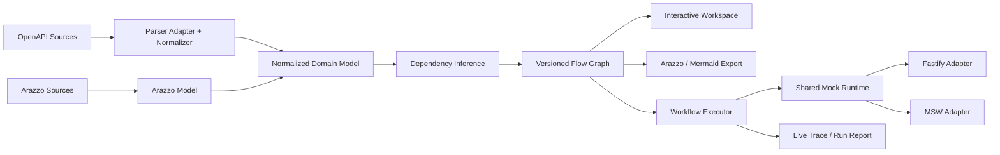

# API Schema Flow

> **將 OpenAPI 的端點清單，轉換成可視化、可執行、可模擬的 API 工作流程。**

API Schema Flow 是一套開源、Local-first 的 API Workflow Workbench。它會匯入 OpenAPI 規格、以互動式拓撲呈現 API 依賴、協助使用者審核有證據的流程推導、輸出標準 Arazzo 工作流，並透過具備狀態的 Mock Runtime 執行整段流程。

> 專案狀態：**Pre-alpha／規格設計階段**。下列 CLI 指令代表預計完成的 MVP 體驗，目前尚未發布 npm 套件。

## 為什麼需要這個專案？

OpenAPI 很擅長描述單一 API Operation，卻很難直接回答流程層級的問題：

- 哪個 Response 欄位會成為下一個 Request 參數？
- 登入、預約、結帳與重試流程分別經過哪些 API？
- 後端欄位改名時，哪些前端流程與測試情境會受影響？
- 後端尚未完成時，前端與 QA 如何操作具有真實生命週期的假資料？

API Schema Flow 不取代 OpenAPI，而是在它之上補上「可執行工作流程層」。

## 目標使用體驗

```bash
# 目標 CLI 體驗；正式發布前仍需確認套件名稱可用性。
npx schema-flow open ./openapi.yaml
```

執行後開啟本機 Workspace，使用者可以：

1. 查看 Endpoint Node、Request 與 Response Schema；
2. 審核 Declared、Manual 與 Inferred 依賴；
3. 接受、拒絕或修改欄位映射；
4. 匯出符合標準的 Arazzo Workflow；
5. 啟動彼此隔離的 Stateful Mock Session；
6. 執行工作流並查看逐步 Live Trace。

## MVP 核心能力

| 能力 | MVP 定義 |
|---|---|
| OpenAPI 匯入 | 正式支援 3.0.x、3.1.x；3.2.x 採相容性設定檔 |
| 工作流標準 | Arazzo 1.1.x 匯入、驗證、視覺化與「明確標示的子集合」執行 |
| 視覺拓撲 | React Flow 節點與連線，使用 ELK Layered Layout |
| 依賴探索 | Declared、Manual 與具證據分數的 Inferred Edge |
| Stateful Mock | In-memory CRUD、固定 Seed、Session 隔離、Reset 與 Snapshot |
| 工作流執行 | 同步 OpenAPI Step、Inputs、Mappings、Outputs、Criteria、Timeout、有限 Retry |
| Live Trace | Step 耗時、Request/Response 摘要、輸出擷取、狀態異動與失敗原因 |
| 匯出 | Arazzo、Mermaid、Project JSON、機器可讀的執行報告 |
| 變更影響 | Post-MVP 的 Flow-aware OpenAPI Diff |

## 差異化原則

API Schema Flow 不會把所有自動產生的連線都視為事實。每條 Edge 都要記錄來源：

- **Declared**：來自 Arazzo 或 OpenAPI Link Object。
- **Manual**：由使用者建立或修改。
- **Inferred**：由確定性規則推導，包含 Confidence 與 Evidence。
- **Observed**：保留給未來從 Trace、HAR、OpenTelemetry 或 Proxy Traffic 取得的證據。

任何 Inferred Edge 在使用者接受前都只是 Candidate，不得直接成為正式工作流。

## 架構摘要



Domain Model、Inference、Execution 與 Mock Runtime 不得直接依賴 React、Fastify、MSW 或特定 OpenAPI Parser。

## 專案邊界

MVP 不會嘗試成為：

- 完整 Postman 替代品或 API Gateway；
- 正式生產流量 Proxy；
- 任意 JavaScript 執行沙箱；
- 僅憑 OpenAPI 就自動宣稱商業流程正確的工具；
- 需要登入、雲端儲存與多人協作的平台。

## 文件入口

完整文件請從 [文件索引](docs/00-DOCUMENT-INDEX.md) 開始。

重要文件：

- [產品需求文件 PRD](docs/02-PRD.md)
- [MVP 範圍與驗收](docs/03-MVP-SCOPE-AND-ACCEPTANCE.md)
- [系統架構](docs/06-SYSTEM-ARCHITECTURE.md)
- [Flow Inference 規格](docs/10-FLOW-INFERENCE-SPEC.md)
- [Stateful Mock Runtime 規格](docs/11-STATEFUL-MOCK-RUNTIME-SPEC.md)
- [Web UX 規格](docs/13-WEB-APP-UX-SPEC.md)
- [安全威脅模型](docs/19-SECURITY-THREAT-MODEL.md)
- [正式開工檢查表](docs/30-IMPLEMENTATION-READINESS-CHECKLIST.md)

English: [README.md](README.md)

## 安全與隱私

MVP 採 Local-first，預設不傳送 Telemetry。Remote `$ref`、URL 匯入、Markdown 呈現、Mock Server 對外暴露與敏感 Header 都屬於明確的 Trust Boundary。詳見 [SECURITY.md](SECURITY.md) 與 [安全威脅模型](docs/19-SECURITY-THREAT-MODEL.md)。

## License

建議採用 **Apache License 2.0**。此專案屬於標準導向的基礎工具，Apache-2.0 的專利授權條款有利於企業採用與外部貢獻。公開 Repo 前仍由專案負責人完成最終確認，記錄於 [Open Decisions](docs/25-OPEN-DECISIONS.md)。
