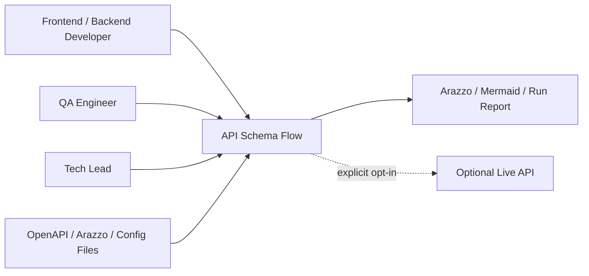
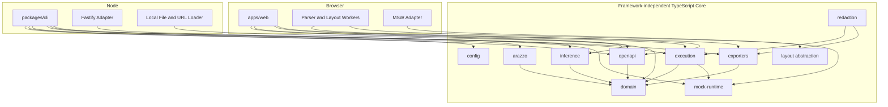
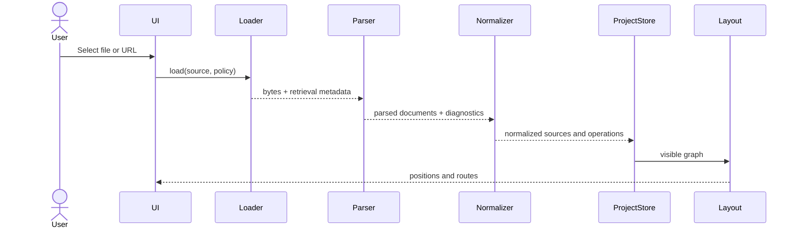
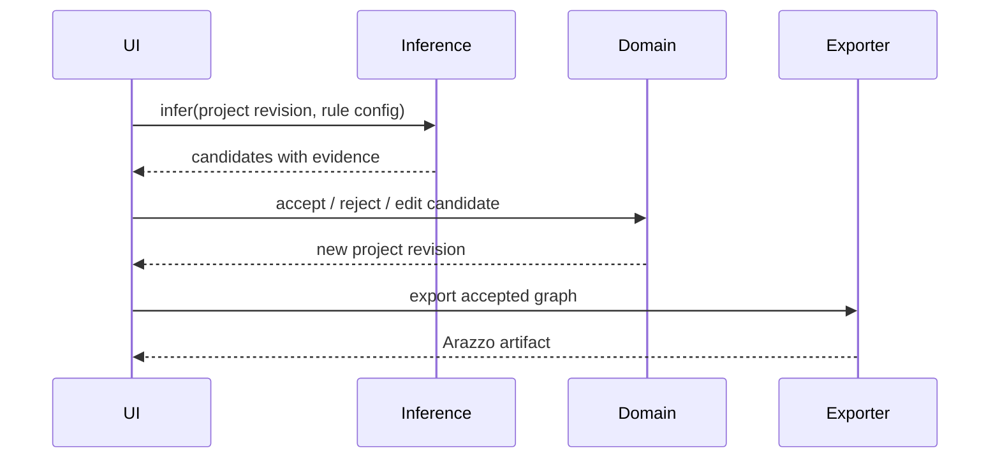
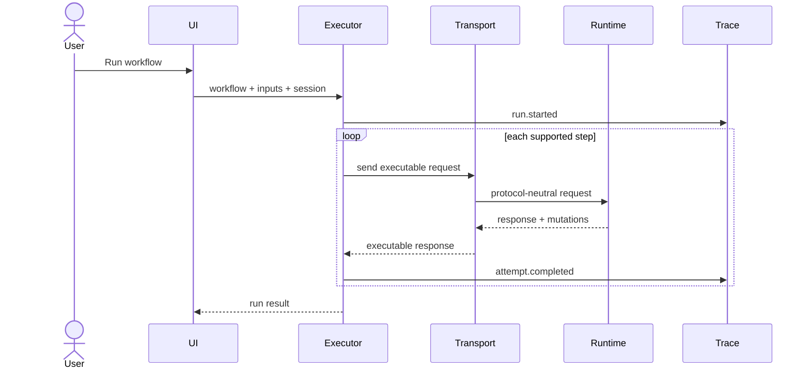

# 系統架構規格

> 狀態：草案，待專案負責人審閱  
> 文件版本：0.1.0  
> 最後更新：2026-09-01  
> 適用範圍：API Schema Flow MVP

## 1. 架構目標

API Schema Flow 必須同時支援 Browser Workspace、CLI、Local Mock Server 與未來 CI，而不讓核心邏輯被任何單一 Framework 綁定。

架構優先事項：

1. Domain Model 與標準解析獨立；
2. 相同 Project 在 Web 與 CLI 產生一致結果；
3. Parser、Layout、HTTP Server 與 Request Interception 都是可替換 Adapter；
4. 所有可持久化資料具 Schema Version；
5. 解析、推導、匯出與 Replay 必須 Deterministic；
6. Local-first 與 Secret Redaction 必須存在於核心，而非只靠 UI。

## 2. 系統情境



MVP 不包含集中式 Cloud Backend。Web UI 與 CLI 都在使用者本機執行。

## 3. Container View



## 4. 模組與責任

### 4.1 `packages/domain`

唯一的共享語意模型，包含：

- Project、Source、Operation、Schema Reference；
- Flow Node、Edge、Mapping、Evidence、Decision；
- Workflow、Step、Input、Output；
- Mock Session、Resource、Fault Profile；
- Trace Run、Attempt、State Mutation；
- Diagnostics 與版本資訊。

不得依賴 React、Node HTTP、Fastify、MSW、ELK、Scalar Parser 或 Faker。

### 4.2 `packages/openapi`

負責：

- Source Loading Interface；
- Parser Adapter；
- Validation 與 `$ref` Resolution；
- OpenAPI 版本識別；
- 轉換為 Normalized Domain Model；
- OpenAPI Link、Security、Example 與 Extension Extraction。

第一個 Adapter 採 `@scalar/openapi-parser`，但外部 API 不得暴露其 Type。

### 4.3 `packages/arazzo`

負責：

- Arazzo 1.1.x Parse、Validate、Normalize；
- Arazzo ↔ Workflow Model Mapping；
- Runtime Expression Parse；
- 支援能力分析；
- Round-trip Preservation；
- Export。

### 4.4 `packages/inference`

負責：

- Candidate Generation；
- Name、Schema、Resource、Auth 與 Lifecycle Rules；
- Score Aggregation；
- Evidence Explanation；
- Candidate Deduplication；
- Acceptance Benchmark。

不得直接寫入 Accepted Workflow。

### 4.5 `packages/layout`

對 ELK 提供封裝：

```ts
interface GraphLayoutEngine {
  layout(input: LayoutGraph, options: LayoutOptions): Promise<LayoutResult>
}
```

UI 只使用封裝後的 Node Position 與 Routed Edge，不依賴 ELK 原生資料結構。

### 4.6 `packages/mock-runtime`

接收協定中立的 Runtime Request，回傳 Runtime Response：

```ts
interface MockRuntime {
  handle(request: RuntimeRequest, context: RuntimeContext): Promise<RuntimeResponse>
}
```

內含：

- Route matching；
- Resource lifecycle；
- State store；
- Example/Schema value generation；
- Fault policy；
- Session、Seed、Snapshot；
- State mutation events。

### 4.7 Adapters

- `adapter-fastify`：真正建立本機 HTTP Server；
- `adapter-msw`：在 Browser/Test Process 中攔截 Request；
- 未來可加入 Hono、Fetch、Bun 或 Worker Adapter。

Adapter 只負責 Protocol Translation、Lifecycle 與 Control Plane Binding。

### 4.8 `packages/execution`

Arazzo Workflow Executor：

- Input validation；
- Step planning；
- Runtime Expression resolution；
- Request construction；
- Transport dispatch；
- Criteria evaluation；
- Output extraction；
- Retry、Timeout、Cancellation；
- Trace event emission。

Transport 介面：

```ts
interface RequestTransport {
  send(request: ExecutableRequest, signal: AbortSignal): Promise<ExecutableResponse>
}
```

Mock 與 Live HTTP 都實作同一介面。

### 4.9 `packages/exporters`

每個 Exporter 都是 deterministic transform：

```ts
interface Exporter<TOptions> {
  export(project: ProjectSnapshot, options: TOptions): ExportArtifact[]
}
```

MVP 包含 Arazzo、Mermaid、Project JSON、Run Report。

### 4.10 `apps/web`

負責：

- Import Wizard；
- Workspace Shell；
- Canvas 與 Inspector；
- Inference Review；
- Workflow Editor；
- Mock Controls；
- Run Console；
- Export Dialog。

UI 不得自行實作推導、Arazzo Evaluation 或 Mock State。

## 5. 主要資料流

### 5.1 Import Flow



### 5.2 Inference Review Flow



### 5.3 Mock Execution Flow



## 6. Project Revision Model

每次影響執行或匯出的修改都建立新 Revision：

- Source Import/Refresh；
- Edge Accept/Reject/Edit；
- Workflow Step 變更；
- Mock Policy 變更；
- Seed Data 變更。

UI-only Position Change 可獨立記錄 Layout Revision，避免不必要地改變 Execution Revision。

Project Snapshot 必須包含：

- `schemaVersion`
- `projectId`
- `revision`
- `createdAt` / `updatedAt`
- Source Fingerprints
- Workflow/Edge Decisions
- Mock Config
- Layout State
- Redaction Policy

Timestamp 不得影響 deterministic content hash。

## 7. 執行模式

### 7.1 Local Workspace

CLI 啟動 Web UI、Fastify Mock 與 Control Plane，全部只綁 Loopback。

### 7.2 Static Playground

Web Bundle 在 Browser 解析範例，使用 MSW Adapter，不依賴 Server-side Upload。

### 7.3 Headless CLI

CI 執行 Validate、Infer、Run 與 Export，不啟動 UI。

### 7.4 Live Mode

明確 Opt-in，Executor 對指定 Server 發送 Request。MVP 不支援任意 Proxy；Live Mode 必須顯示 Host、遮罩 Secret、限制 Redirect，並允許 Dry Run。

## 8. Error Model

所有核心錯誤轉為 `Diagnostic`：

```ts
type Diagnostic = {
  code: string
  severity: 'error' | 'warning' | 'info'
  message: string
  sourceId?: string
  pointer?: string
  operationId?: string
  workflowId?: string
  stepId?: string
  hint?: string
  causeCode?: string
}
```

規則：

- UI、CLI 與 JSON 輸出使用相同 Code；
- 不把完整 Secret 或 Payload 放入 Message；
- Parser 原生 Stack 只在 Debug Mode；
- 可恢復錯誤不得造成整個 Workspace Crash；
- 執行前可檢測的 Unsupported Feature 必須 Fail Fast。

Code Namespace：

- `IMP-*` Import；
- `OAS-*` OpenAPI；
- `ARZ-*` Arazzo；
- `INF-*` Inference；
- `MCK-*` Mock；
- `EXE-*` Execution；
- `EXP-*` Export；
- `SEC-*` Security；
- `CFG-*` Configuration。

## 9. Concurrency 與 Worker

- Browser 的 Parse、Dereference、Inference 與 Layout 應可移至 Web Worker；
- 每次工作帶 `projectRevision`，舊 Revision 的結果不得覆蓋新狀態；
- Layout 可取消或丟棄；
- Executor 以 AbortController 支援取消；
- Mock Session Store 的 Mutation 必須序列化，避免同 Session Race；
- 不同 Session 可平行執行。

## 10. Persistence

MVP：

- 預設 In-memory；
- Project 由使用者匯出/匯入 JSON；
- Browser 可選擇 IndexedDB 保存最近 Project，但必須可關閉與清除；
- Mock State 不跨 Process 持久化，除非使用 Snapshot Export。

未來 Persistence 必須透過 Adapter，不得讓 Runtime 直接依賴 SQLite、Redis 或 Cloud Database。

## 11. Dependency Direction

允許：

```text
apps -> feature packages -> domain
adapters -> runtime interfaces -> domain
exporters -> domain
```

禁止：

```text
domain -> apps
domain -> adapters
mock-runtime -> Fastify
inference -> React
openapi -> UI store
exporters -> browser DOM
```

CI 應以 dependency-cruiser、eslint boundary rule 或等效工具強制。

## 12. 技術選型

| 層 | 選型 | 理由 |
|---|---|---|
| Monorepo | pnpm + Turborepo | Workspace、Cache、Task Graph |
| Language | TypeScript strict | 共用 Browser/Node Model |
| Web | React + Vite + Tailwind CSS | 快速、可組合、靜態部署 |
| Canvas | `@xyflow/react` | Node/Edge、Controls、Custom Renderer |
| Layout | `elkjs` | 適合 Layered Data-flow Graph |
| Parser | Scalar OpenAPI Parser Adapter | 支援多代 OpenAPI，採 Adapter 隔離 |
| HTTP Adapter | Fastify | 本機 HTTP Server、低框架耦合 |
| Browser Mock Adapter | MSW | Browser/Test Request Interception |
| Data generation | Faker Adapter + deterministic generator | Schema-aware fake values |
| Unit/Integration | Vitest | TypeScript 與 Vite 生態 |
| E2E | Playwright | Browser、CLI-assisted Workspace |
| Release | Changesets | Monorepo Package Versioning |

具體版本只在 Lockfile 與 Renovate/Dependabot Policy 中管理，文件不綁 Patch Version。

## 13. Rejected Architecture

### 13.1 所有功能放進單一 Vite App

拒絕原因：CLI、CI、Mock Server 無法乾淨重用；Domain 邏輯容易進入 React Hooks。

### 13.2 Fastify 直接管理 State

拒絕原因：MSW、Test 與未來 Adapter 無法共享；Request/Reply Type 汙染 Runtime。

### 13.3 直接以 React Flow Node 作為 Domain Model

拒絕原因：視覺表示與標準語意耦合，無法在 CLI 使用，也難以版本化。

### 13.4 自訂 Workflow DSL 取代 Arazzo

拒絕原因：造成 Vendor Lock-in、重複標準工作，且不利於外部工具互通。

### 13.5 MVP 使用 LLM 決定所有流程

拒絕原因：不可重現、成本與隱私風險、難以量測 Precision；未來只能作為附加 Evidence Source。
