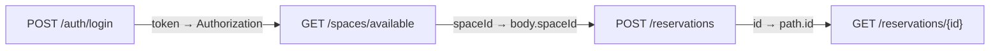

# Export 規格

> 狀態：草案，待專案負責人審閱  
> 文件版本：0.1.0  
> 最後更新：2026-09-01  
> 適用範圍：API Schema Flow MVP

## 1. 目標

Export 將 Project 中已確認的語意轉為可版本控制、可分享、可由其他工具讀取的 Artifact。所有 Export 必須 deterministic、可追溯、預設 Redact，且不把 Candidate 當作正式流程。

## 2. MVP Formats

| Format | Extension | 用途 |
|---|---|---|
| Arazzo | `.yaml` / `.json` | 標準 Workflow 交換 |
| Mermaid | `.md` / `.mmd` | README、文件與架構圖 |
| Project Snapshot | `.json` | 保存 Decisions、Layout、Mock Config |
| Run Report | `.json` | CI、Issue、Replay 證據 |

Post-MVP：

- PDF；
- SVG/PNG；
- Postman Collection；
- SARIF；
- HTML Report。

## 3. 共通 Export Contract

```ts
interface ExportRequest {
  format: string
  projectRevision: number
  workflows?: string[]
  mode: 'canonical' | 'preserve' | 'generated'
  redactionPolicy: RedactionPolicy
  options: Record<string, unknown>
}
```

```ts
interface ExportArtifact {
  fileName: string
  mediaType: string
  bytes: Uint8Array
  contentHash: string
  diagnostics: Diagnostic[]
}
```

規則：

- Export 使用 Immutable Snapshot；
- 同一 Request 產生相同 Byte Output，除非 Format 明確包含時間；
- Timestamp 放在 Metadata 時可由 `--reproducible` 排除；
- Candidate、Rejected Edge 不輸出；
- Disabled Declared Edge 的處理必須明確；
- Export 前先執行 Redaction 與 Support Validation；
- Existing File 不覆寫，除非明確 Force。

## 4. Arazzo Export

### 4.1 Modes

- `preserve`：匯入 Arazzo 後盡量保留；
- `canonical`：標準化排序與格式；
- `generated`：由 Accepted Graph 新建。

### 4.2 Canonical Ordering

1. `arazzo`
2. `$self`（若使用）
3. `info`
4. `sourceDescriptions`
5. `workflows`
6. `components`
7. Extensions

Workflow：

- 依 Project 明確順序；
- Step 依執行順序；
- Map Key 使用穩定排序；
- 不因 UI Selection 改變順序。

### 4.3 Validation

輸出前：

- Arazzo Schema Validation；
- Operation Resolution；
- Runtime Expression Validation；
- Unsupported/Lossy Check；
- Duplicate ID；
- Secret Scan。

Blocking Error 時不得輸出標示為成功的 Artifact；可提供 `invalid-preview` 只供 Debug，File Name 必須清楚。

## 5. Mermaid Export

### 5.1 Diagram Types

- `topology`
- `workflow`
- `impact`（Post-MVP）

範例：



### 5.2 安全與相容

- Node ID 使用安全 Hash，不直接使用 Path；
- Label Escape；
- Markdown/HTML 預設關閉；
- Mermaid Directive 不接受使用者任意注入；
- 過長 Label 截斷但提供 Legend；
- 不使用只有顏色才能理解的 Style；
- GitHub 可直接 Render。

### 5.3 Edge Filter

可選：

- Accepted only（預設）；
- Declared/Manual；
- Include Inferred Candidates（必須明顯標記，不用於正式架構文件）；
- Workflow-specific。

## 6. Project Snapshot

包含：

- Schema Version；
- Project Metadata；
- Source Fingerprint/Location；
- Normalized References 或 Re-import instructions；
- Workflows；
- Edge Decisions；
- Mock Config；
- Layout；
- Redaction；
- Tool Compatibility。

預設不內嵌完整 OpenAPI/Arazzo Source，以降低敏感資料與檔案大小；可用 `bundleSources: true` 明確選擇，並再次顯示安全警告。

不包含：

- Secret Value；
- Browser Token；
- Local Absolute Home Path；
- Unredacted Run Payload；
- Cache。

## 7. Run Report

詳見 Execution Spec。Export 額外要求：

- Redaction Summary；
- Report Version；
- Project Fingerprint；
- Tool Version；
- Seed；
- Session Hash；
- Inputs Hash/Redacted Value；
- Attempt Timeline；
- Diagnostics；
- 若 Live Mode，Target Origin；
- 不含 DNS/IP Resolution Details，除非 Debug 且使用者選擇。

## 8. File Naming

預設：

```text
<project>-<workflow>.arazzo.yaml
<project>-topology.mmd
<project>.schema-flow.json
<project>-<workflow>-run.json
```

- Slug 安全；
- 長度限制；
- 不包含 Secret/User Input Raw Path；
- 同名時 Fail 或由 UI 提示；
- 不自動加不可預測亂數。

## 9. Redaction

Export Pipeline：

```text
Clone Snapshot
  → Apply Built-in Header Redaction
  → Apply Project JSON Pointer Redaction
  → Apply Secret Markers
  → High-entropy Scan
  → User Preview
  → Serialize
  → Final Scan
```

如果 Final Scan 發現疑似 Secret：

- 阻擋；
- 顯示 Pointer/類型，不顯示完整值；
- 使用者可將其加入 Redaction；
- 不提供「仍然輸出明文」的 CLI Shortcut 於 CI。

## 10. PDF 與 Postman 決策

PDF 不列入 MVP，因為：

- Mermaid/SVG 已能滿足文件；
- PDF Layout、Pagination、Font 與 Accessibility 會增加大量範圍；
- 不影響核心產品驗證。

Postman Collection 不列入 MVP，因為：

- Arazzo 是主要 Workflow Standard；
- 轉換複雜且容易丟失語意；
- 產品不應一開始競爭完整 API Client。

## 11. Diagnostics

- `EXP-CANDIDATE-NOT-INCLUDED`
- `EXP-WORKFLOW-INVALID`
- `EXP-LOSSY-CONVERSION`
- `EXP-UNSUPPORTED-FEATURE`
- `EXP-SECRET-DETECTED`
- `EXP-FILE-EXISTS`
- `EXP-PATH-BLOCKED`
- `EXP-MERMAID-LABEL-ESCAPED`
- `EXP-DETERMINISM-VIOLATION`

## 12. Acceptance Criteria

1. Arazzo 通過 Schema Validation；
2. 相同輸入 Byte Output 一致；
3. Candidate 不輸出；
4. Secret Scan 通過；
5. Mermaid 可在 GitHub Render；
6. Project Snapshot 可重新開啟並保留 Decisions；
7. Preserve Mode 無法無損時阻擋或警告；
8. 不覆寫既有檔案；
9. File Name 安全；
10. CLI `--stdout` 與 File Output 語意一致。
