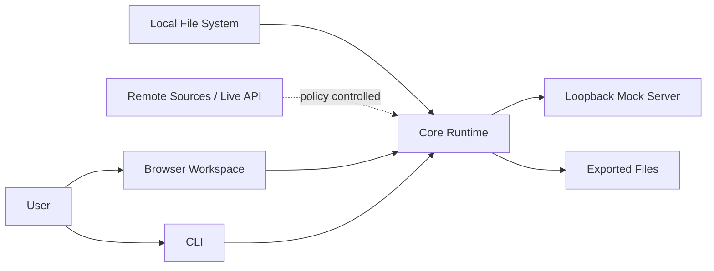

# 安全威脅模型

> 狀態：草案，待專案負責人與安全審查者確認  
> 文件版本：0.1.0  
> 最後更新：2026-09-01  
> 適用範圍：API Schema Flow MVP

## 1. 安全目標

API Schema Flow 會處理內部 API 規格、範例資料、認證資訊、Mock State 與執行 Trace。主要安全目標是：

1. 不因匯入不可信規格而執行程式碼或耗盡資源；
2. 不讓 Remote `$ref`、Redirect 或 Live Execution 存取未授權網路；
3. 不把 Secret 寫入畫面、Log、Snapshot、Project 或 Export；
4. 不讓不同 Mock Session 互相讀寫資料；
5. 不讓本機 Mock Server 意外暴露至區域網路或網際網路；
6. 發生錯誤時 Fail Closed，並提供可理解的 Diagnostic。

## 2. 範圍與信任假設

### 2.1 受保護資產

- 私有 OpenAPI/Arazzo 文件與路徑；
- Authorization Header、Cookie、API Key、Token 與測試帳號；
- Request/Response Payload；
- Mock Session State 與 Snapshot；
- Live API Host、Network Topology 與 Trace；
- Project 設定、Rejected/Accepted Inference Decisions；
- 使用者本機檔案系統與 Loopback Ports；
- 發布套件與更新供應鏈。

### 2.2 不可信輸入

- 本機與遠端 OpenAPI/Arazzo；
- `$ref`、Server URL、Link、Callback URL、External Docs；
- Markdown Description、Example、Schema Pattern；
- Project JSON、Snapshot、Seed 與 Run Report；
- CLI 參數、環境變數與 Config；
- Mock Request；
- npm Dependency 與 Build Artifact。

### 2.3 MVP 信任邊界



MVP 沒有雲端控制平面。Browser、CLI、Core 與 Mock Server 仍視為不同邊界，不能假設任意輸入都可信。

## 3. 安全預設值

| 項目 | 預設 |
|---|---|
| Mock Bind Address | `127.0.0.1` / `::1` |
| Remote Source | 允許 HTTPS；HTTP 需明確旗標 |
| Private Network Remote Ref | 拒絕 |
| Redirect | 最多 3 次，每次重新驗證目標 |
| Live API Execution | 關閉 |
| Telemetry | 關閉 |
| State Persistence | 記憶體 |
| Trace Body | 限制大小並 Redact |
| Arbitrary Script | 不支援 |
| Browser Auto-open | 僅 Loopback URL |
| CORS | 僅明確 Origins，不使用萬用字元搭配 Credentials |

## 4. 威脅與控制

### 4.1 解析與資源耗盡

| 威脅 | 範例 | 必要控制 |
|---|---|---|
| YAML Alias Bomb | 大量 Alias 展開 | 限制 Alias、Node Count、Depth 與解析時間 |
| 深度 `$ref`/Cycle | 遞迴 Reference | Cycle Detection、Depth Budget、Memoization |
| 超大文件 | GB 級 JSON/YAML | 下載與讀取 Size Limit、Streaming/Abort |
| 高成本 Pattern | 惡意 Regex | 不執行不可信 Regex；必要時採安全引擎與 Timeout |
| Schema Explosion | `allOf` 組合爆炸 | Lazy Resolution、Expansion Budget |
| Layout DoS | 極大量 Nodes/Edges | 數量 Gate、Worker、可取消、Overview Mode |

### 4.2 SSRF 與網路越權

Remote Loader 必須在 DNS Resolution 前後都驗證目標，避免 DNS Rebinding。

拒絕或限制：

- `file:`, `ftp:`, `gopher:`, `data:`, `javascript:`；
- Loopback、Link-local、Private、Multicast、Metadata Service IP；
- URL 中的 User Info；
- 重新導向至不同安全等級的 Host；
- 無上限下載、無 Timeout 或無 Content-Type 檢查；
- 由 OpenAPI `servers` 自動觸發的請求。

Live Execution 只能由使用者明確啟用。CLI 在非互動 CI 模式下必須使用顯式 `--allow-host` 或等價設定。

### 4.3 檔案系統風險

| 威脅 | 控制 |
|---|---|
| Path Traversal | 所有相對路徑以 Project Root Resolve，確認結果仍在允許根目錄 |
| Symlink Escape | Resolve Real Path 後再做根目錄檢查 |
| Overwrite | 預設拒絕覆蓋；使用 Atomic Write |
| Zip Slip | Diagnostic/Import Archive 逐項驗證 Path |
| Device/Special File | 僅接受 Regular File |
| Unsafe Permission | Snapshot/Trace 含敏感內容時使用 Owner-only 權限，平台不支援時警告 |

### 4.4 內容注入與前端安全

- 所有 Markdown 先 Parse 再 Sanitization；
- 禁止執行規格中的 HTML Script、Event Handler 與 `javascript:` URL；
- SVG Export 不嵌入未清理的外部內容；
- React 不使用未清理的 `dangerouslySetInnerHTML`；
- External Link 使用安全的 `rel`；
- Content Security Policy 禁止 `unsafe-eval`；
- URL 與 Source Pointer 顯示時做文字編碼；
- Canvas Label、Error Message 與 CLI 終端輸出避免 ANSI/Control Character Injection。

### 4.5 Secret 洩漏

Redaction 必須在資料離開 Core Boundary 前執行，而非只在 UI 隱藏。

#### 預設遮罩來源

- `Authorization`
- `Proxy-Authorization`
- `Cookie` / `Set-Cookie`
- `X-API-Key` 與常見 API Key Header
- OpenAPI Security Scheme 對應 Header/Query/Cookie
- 名稱符合 `token`, `secret`, `password`, `credential`, `apiKey`, `accessKey` 的欄位
- 使用者額外設定的 JSON Pointer / Header

#### 輸出策略

```text
Original value -> Classify -> Redact -> Size-limit -> Persist/Render
```

- Redacted Value 使用固定標記，不保留可推測長度；
- Hash 僅用於關聯同一 Secret 時，且使用每次 Run 的 Salt；
- Query String 也需 Redact；
- Error Stack 不得附上完整 Payload；
- `--verbose`、Debug Build 與 Crash Report 仍遵守同一政策；
- 使用者關閉 Redaction 時必須二次確認，且輸出檔加入 `containsSensitiveData: true`。

### 4.6 Mock Server 暴露

- 預設只綁定 Loopback；
- 指定 `0.0.0.0` 或外部 Interface 時顯示高風險警告；
- Control Plane 與 Mock Data Plane 使用不同不可猜 Token 或不同 Port；
- Reset、Snapshot、Restore、Fault Injection 等管理端點不得暴露給一般 Mock Client；
- Request Body、Header Count、Header Size、Concurrent Connection 都有限制；
- 不轉發未知 Route 至網際網路；
- Directory Listing 關閉；
- 服務停止時清理臨時檔與 Port Metadata。

### 4.7 Session 隔離與狀態完整性

- Session ID 使用高熵隨機值，不接受可遍歷流水號作為唯一識別；
- Store API 每次操作都要求明確 Session Context；
- 禁止 Global Mutable Store；
- Snapshot 內含 Project Fingerprint 與 Schema Version；
- Restore 前驗證 Project、Resource Schema 與 Checksum；
- Parallel Test 為每個 Worker 配置獨立 Session；
- Fault Rule 的剩餘次數、Seed 與 ID Sequence 亦屬 Session State；
- Adapter Parity Tests 必須驗證 Fastify/MSW 不造成跨 Session 洩漏。

### 4.8 任意程式碼與外掛

MVP 不支援：

- JavaScript expression；
- Dynamic `eval` / `Function`；
- npm package resolver；
- Shell hook；
- Template 中的任意函式；
- 從 OpenAPI Extension 自動載入 Plugin。

可接受的行為以聲明式規則表達，例如：狀態轉換、欄位映射、延遲、錯誤率與有限運算子。未來 Plugin 必須另立沙箱、權限與簽章 ADR。

### 4.9 供應鏈

- Commit Lockfile；
- CI 使用 Frozen Lockfile；
- 發布採 Provenance/Attestation；
- npm Package 啟用 2FA 與最小化 Maintainer；
- Release Workflow 受 Protected Environment 管控；
- Dependency Update 經測試後合併；
- `preinstall`/`postinstall` Script 依賴需審查；
- Source Map、Test Fixture 與私有文件不得誤包入 npm Tarball；
- 發布前以 `npm pack --dry-run` 或等價方法審查內容；
- Binary Dependency 必須有來源、Checksum 與 License 記錄。

## 5. 權限矩陣

| 動作 | Browser UI | CLI Interactive | CI Non-interactive |
|---|---|---|---|
| 讀取本機來源 | 使用者選擇 | 明確路徑 | Repo 內允許路徑 |
| 讀取 HTTPS 來源 | 顯示 Host | 顯示 Host | Allowlist |
| 讀取 Private Network | 預設拒絕 | 顯式旗標與警告 | 明確 Allowlist |
| 啟動 Loopback Mock | 允許 | 允許 | 允許 |
| 綁定外部 Interface | 不在 MVP UI 提供 | 顯式旗標 | 預設拒絕 |
| 呼叫 Live API | 每次 Workspace Opt-in | 顯式旗標 | Allowlist + Credential Source |
| 寫入 Export | 使用者選擇 | 明確路徑 | Workspace Artifact 路徑 |

## 6. 安全事件與記錄

Security-relevant Event 至少包含：

- Remote Host 被拒絕；
- Redirect 被拒絕；
- Size/Timeout Budget 觸發；
- Live Execution 啟用；
- Redaction 關閉；
- 外部 Interface Bind；
- Snapshot 驗證失敗；
- 不支援/危險 Project Setting；
- Integrity Check 失敗。

Event 預設只保存在本機目前 Session，不上傳。

## 7. 已接受的剩餘風險

MVP 可能仍存在：

1. 使用者主動允許 Live Host 後，API 本身可能造成副作用；
2. Schema-generated Fake Data 不等於真實業務資料；
3. 設定錯誤的自訂 Redaction Rule 可能漏掉未知敏感欄位；
4. Browser Extension 或本機惡意程式可讀取使用者有權存取的資料；
5. 大型合法規格仍可能造成明顯資源消耗。

產品必須透過清楚提示、最小權限、限制預設與文件降低風險，不應宣稱完全消除。

## 8. Security Release Gate

- 所有上述 High-risk Threat 有自動化測試；
- Secret Redaction Matrix 覆蓋 Header、Query、Cookie、JSON Body、Error 與 Export；
- Remote Loader 有 SSRF/DNS Rebinding 測試；
- Mock Server 預設 Bind 與管理端點隔離經整合測試；
- 沒有任意程式碼執行路徑；
- Dependency、License、Secret 與 npm Package Content 掃描通過；
- `SECURITY.md` 有有效私密回報管道；
- Maintainer 完成至少一次威脅模型審查並記錄變更。
