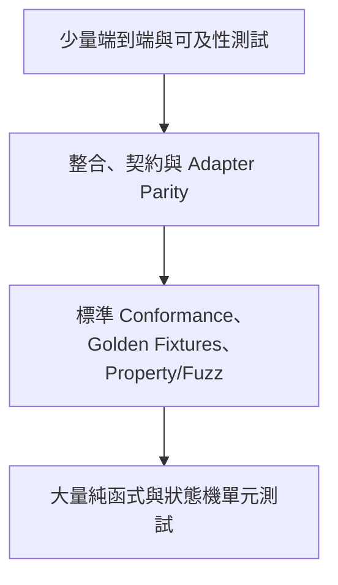

# 測試策略

> 狀態：草案，待專案負責人審閱  
> 文件版本：0.1.0  
> 最後更新：2026-09-01  
> 適用範圍：API Schema Flow MVP

## 1. 目標

測試策略不是只追求 Coverage 百分比，而是為下列高風險承諾提供證據：

- 不同 Parser/Adapter 仍產生一致 Domain Behavior；
- 推導結果可解釋、可重現且不會默默成為正式流程；
- Stateful Mock 在 CRUD、Fault、Seed、Snapshot 與並行 Session 下保持一致；
- Arazzo Workflow 執行、Runtime Expression 與 Trace 可重現；
- Secret 不會進入任何持久化或顯示通道；
- Windows、macOS、Linux 與 Browser 的主要旅程可用；
- 文件聲明與實作能力一致。

## 2. 測試分層



| 層級 | 用途 | 主要對象 |
|---|---|---|
| Unit | 快速驗證純邏輯與錯誤邊界 | Domain、Normalizer、Rules、State Reducer、Redaction |
| Property | 驗證不變條件與大量組合 | ID、Mapping、Snapshot、Round-trip、Determinism |
| Fixture/Golden | 固定輸入對應固定輸出 | OpenAPI、Arazzo、Inference、Export、Diagnostics |
| Conformance | 對照正式規格與官方/公開樣本 | OpenAPI/Arazzo Parser、Runtime Expression |
| Integration | 驗證跨 Package 行為 | Import→Domain、Workflow→Transport、Mock→Trace |
| Contract | 保護 Package Public API 與 Adapter 介面 | Parser、Transport、Store、Exporter |
| E2E | 驗證真實使用者旅程 | Web、CLI、Local Server |
| Security | 驗證惡意輸入與安全預設 | Loader、Renderer、Mock、Export |
| Performance | 防止大型規格與 Trace Regression | Parser、Layout、Inference、Runtime |
| Accessibility | 鍵盤、Screen Reader 語意與 Reduced Motion | Web Workspace |

## 3. Fixture 分類

```text
fixtures/
├─ openapi/
│  ├─ valid/
│  ├─ invalid/
│  ├─ refs/
│  ├─ security/
│  ├─ links/
│  ├─ large/
│  └─ malicious/
├─ arazzo/
│  ├─ valid/
│  ├─ unsupported-valid/
│  ├─ invalid/
│  └─ runtime-expressions/
├─ inference/
│  ├─ positive/
│  ├─ ambiguous/
│  ├─ negative/
│  └─ benchmark/
├─ mock/
│  ├─ crud/
│  ├─ pagination/
│  ├─ faults/
│  ├─ sessions/
│  └─ snapshots/
└─ projects/
   ├─ reservation/
   ├─ ecommerce/
   └─ authentication/
```

每個 Fixture 附 Metadata：

```yaml
id: reservation-create-get
purpose: Verify POST response id maps to GET path id
sourceLicense: CC0-1.0
expected:
  diagnostics: []
  candidates:
    acceptedBenchmark:
      - source: createReservation.response.body#/id
        target: getReservation.path#/id
```

不得把來源不明或含真實憑證的企業規格提交至 Repo。

## 4. 核心套件測試

### 4.1 Domain

- Stable ID 在路徑、大小寫與欄位順序正規化後符合規則；
- Graph 不接受懸空 Node、重複 ID 或非法 Status Transition；
- Candidate 不可直接變成 Accepted Edge；
- Serialization/Deserialization 保留 Unknown Extension；
- 不同 Schema Version 觸發正確 Migration/Diagnostic。

### 4.2 OpenAPI Ingestion

- YAML/JSON、OpenAPI 3.0/3.1 與 Compatibility Mode；
- Internal/External `$ref`、Cycle、Missing Ref、Duplicate Operation ID；
- Link、Security、Request/Response、Examples 與 Source Pointer；
- Path、Method、Parameter Merge 與 Server Inheritance；
- Parser Error 轉換成穩定 Diagnostic；
- Malicious Size、Depth、Alias 與 Remote Ref Budget。

### 4.3 Arazzo

- Valid/Invalid Arazzo 1.1.x；
- Source Description 與 Operation Reference；
- Workflow Inputs/Outputs、Steps、Parameters、Request Body；
- Runtime Expression Parse 與 Resolve；
- Success Criteria；
- 支援矩陣分析；
- 未支援但合法欄位 Round-trip Preservation；
- Import→Export→Import 語意等價。

### 4.4 Inference

每條 Rule 必須至少有：

- Positive Fixture；
- Ambiguous Fixture；
- Negative Fixture；
- Score Breakdown Snapshot；
- Explanation Snapshot；
- Determinism Test；
- Duplicate Suppression Test。

Benchmark 不只看 Recall。High-confidence Candidate 的 Precision 是 Release Gate，因為錯誤的高信心建議會破壞使用者信任。

### 4.5 Mock Runtime

以狀態機測試：

```text
Empty
  -> POST
Created
  -> GET
  -> PATCH
Updated
  -> DELETE
Deleted
  -> GET => declared not-found
```

另驗證：

- Seed 與固定 ID Sequence；
- List 與 Pagination；
- Snapshot/Restore 原子性；
- Fault 次數、機率與固定亂數；
- Delay/Timeout/Cancellation；
- Schema Value Generation；
- Session Isolation；
- Concurrent Mutation；
- Unknown Route/Method；
- Adapter-independent Runtime Request/Response。

### 4.6 Execution 與 Trace

- Topological/Declared Step Order；
- Input Validation；
- Request Mapping 與 Output Extraction；
- Missing/Null/Type Mismatch；
- Success/Failure Criteria；
- Retry Eligibility；
- Retry 不重複不可重試副作用；
- Timeout 與 Abort；
- Mock/Live Transport Contract；
- 每個 Trace Event 順序、Correlation 與 Redaction；
- Unsupported Feature 在發送 Request 前失敗。

### 4.7 Export

- Stable Ordering；
- Line Ending 與 UTF-8；
- Arazzo Round-trip；
- Mermaid Syntax；
- JSON Schema Validation；
- Secret Redaction；
- Same Input Same Bytes；
- 不覆蓋檔案與 Atomic Write。

## 5. Adapter Parity

同一組 Runtime Contract Test 必須套用至每個 Adapter：

```ts
interface MockAdapterContract {
  start(): Promise<AdapterHandle>
  request(input: RuntimeRequest): Promise<RuntimeResponse>
  stop(): Promise<void>
}
```

Fastify 與 MSW 對以下行為必須一致：

- Route Matching；
- Header/Query/Body Mapping；
- CRUD State；
- Session Selection；
- Fault；
- Not Found；
- Trace Events；
- Redaction；
- Reset/Snapshot Control。

Protocol 限制造成的差異必須文件化，而不是隱藏在實作中。

## 6. 端到端旅程

### E2E-001：Reservation Golden Path

1. CLI 開啟 Reservation OpenAPI；
2. UI 顯示 Operations；
3. 接受三個候選 Edge；
4. 匯出 Arazzo；
5. 啟動 Mock；
6. 執行 Login→List Spaces→Create Reservation→Get Reservation；
7. Trace 全部成功；
8. POST 產生的 ID 與 GET 結果一致。

### E2E-002：Ambiguous Inference

1. 匯入多個 `id` 欄位的規格；
2. 不得產生 High-confidence Generic ID Edge；
3. 使用者可查看 Evidence；
4. Reject 後重新載入 Project，Decision 保留；
5. Export 不包含 Rejected Candidate。

### E2E-003：Fault and Retry

1. Create Step 第一次回 429；
2. Retry Policy 等待後重試；
3. 第二次成功；
4. Trace 顯示兩次 Attempt；
5. Store 只新增一筆 Entity。

### E2E-004：Security Defaults

1. 嘗試 Remote Ref 指向 Loopback/Metadata Host；
2. 系統拒絕且無實際連線；
3. Trace 中 Authorization、Cookie、Token 均被遮罩；
4. Mock 只監聽 Loopback；
5. Live API 未 Opt-in 前不可執行。

### E2E-005：Keyboard-only

使用鍵盤完成 Import、搜尋、選取 Candidate、接受、Run、閱讀 Trace 與 Export。

## 7. 測試資料決定性

- Faker/Random 一律注入 Seeded RNG；
- Clock 由介面注入；
- UUID 由 ID Generator 注入；
- Network 使用本機 Test Server，不依賴公共服務；
- Snapshot 排除不穩定 Absolute Path，或先正規化；
- OS 路徑差異以 Platform Fixture 驗證；
- Parallel Test 不共用 Port、Session 或 Temp Directory。

## 8. Coverage 與品質門檻

Coverage 不是唯一標準，但提供最低防線：

| 範圍 | Line | Branch |
|---|---:|---:|
| Domain / Redaction / Config | ≥ 95% | ≥ 90% |
| Inference / Mock Runtime / Execution | ≥ 90% | ≥ 85% |
| Parser/Adapter/Exporter | ≥ 85% | ≥ 80% |
| UI Components | ≥ 75% | ≥ 70% |

此外：

- 所有 Requirement `Must` 至少對應一個 Test ID；
- 所有 Diagnostic Code 至少有一個觸發測試；
- 所有 Security High-risk Control 有 Negative Test；
- 所有 Accepted ADR 的核心決策有 Boundary/Architecture Test；
- Coverage 下降需要 PR 中說明，不可只更新門檻規避。

## 9. CI Pipeline

```text
Install
  -> Format/Lint
  -> Typecheck
  -> Unit/Property
  -> Fixture/Conformance
  -> Build
  -> Integration/Adapter Parity
  -> E2E
  -> Accessibility
  -> Security/License/Secret Scan
  -> Package Inspection
```

### PR 必跑

- Format、Lint、Typecheck；
- Unit、Property、Fixture；
- Changed Package Build；
- Relevant Integration；
- Secret/Dependency Scan；
- Markdown Link Check；
- Requirement/Diagnostic Registry Check。

### Main / Nightly

- 全平台 Matrix；
- Browser Matrix；
- Fuzz；
- Large Benchmark；
- Full E2E；
- npm Pack Inspection；
- Flaky Test Detection。

## 10. Flaky Test 政策

- 不以無限 Retry 掩蓋 Flaky；
- 發現 Flaky Test 時建立 Issue，標示 Owner、原因與隔離期限；
- Security、Data Integrity、Session Isolation Test 不得 Quarantine 後仍發布；
- Retry 次數與第一次失敗都需記錄；
- Release Branch 不允許未知 Flaky。

## 11. Release Test Evidence

每個 Release Candidate 保存：

- Commit SHA；
- Toolchain Versions；
- Test Matrix；
- Coverage；
- Benchmark；
- Security Scan；
- Package Manifest；
- Quickstart Smoke Test；
- Known Limitations；
- Requirements Traceability Snapshot。

這些證據可作為 GitHub Release Artifact 或 CI Summary，不含 Secret。
