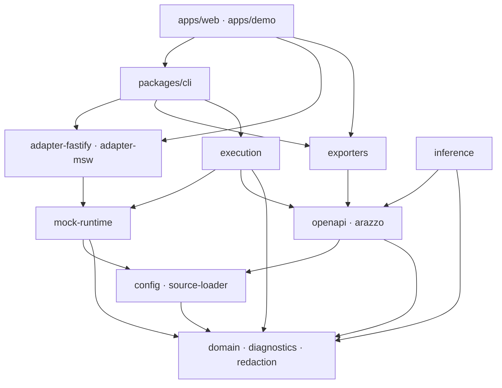

# Repository 與 Monorepo 結構規格

> 狀態：草案，待專案負責人審閱  
> 文件版本：0.1.0  
> 最後更新：2026-09-01  
> 適用範圍：API Schema Flow Monorepo

## 1. 技術基線

- Monorepo：Turborepo；
- Package Manager：pnpm Workspace；
- Language：TypeScript Strict；
- Web：React + Vite；
- Styling：Tailwind CSS；
- Canvas：`@xyflow/react`；
- Layout Adapter：ELK.js；
- Node HTTP Adapter：Fastify；
- Browser Interception Adapter：MSW；
- Schema/Config Validation：採可輸出 JSON Schema 的 Runtime Validator；
- Test：支援 Unit、Browser E2E、Property/Fuzz 與 Package Contract 的工具組合；
- Formatting/Linting：以單一 Repo 設定管理。

實際工具版本在初始化時鎖定，不在規格文件預先寫死。

## 2. 建議目錄

```text
api-schema-flow/
├─ apps/
│  ├─ web/                         # 本機 Workspace 與靜態 Playground
│  ├─ docs/                        # 公開文件站，M5 前建立
│  └─ demo/                        # 可部署、只含公開 Fixtures 的展示版
│
├─ packages/
│  ├─ domain/                      # 唯一共享語意模型
│  ├─ diagnostics/                 # Diagnostic Code、Formatter、Registry
│  ├─ redaction/                   # Secret classification/redaction
│  ├─ config/                      # Config/Project schema 與 migration
│  ├─ source-loader/               # File/URL loading policy abstraction
│  ├─ openapi/                     # Parse、normalize、links、security
│  ├─ arazzo/                      # Parse、validate、runtime expressions
│  ├─ inference/                   # Candidate rules/evidence/scoring
│  ├─ layout/                      # Layout abstraction 與 ELK adapter
│  ├─ mock-runtime/                # Stateful store、CRUD、fault、snapshot
│  ├─ adapter-fastify/             # 真正的本機 HTTP server
│  ├─ adapter-msw/                 # Browser/Test request interception
│  ├─ execution/                   # Workflow executor、transport、trace
│  ├─ exporter-arazzo/
│  ├─ exporter-mermaid/
│  ├─ exporter-report/
│  ├─ ui/                          # 共用可及性 UI primitives
│  ├─ cli/                         # Command definitions 與 orchestration
│  └─ test-fixtures/               # 可公開、具來源紀錄的 fixtures
│
├─ examples/
│  ├─ reservation/
│  ├─ ecommerce/
│  └─ authentication/
│
├─ docs/
│  ├─ adr/
│  └─ ...                          # 本文件包
│
├─ tooling/
│  ├─ eslint-config/
│  ├─ tsconfig/
│  ├─ test-config/
│  └─ scripts/
│
├─ .github/
│  ├─ ISSUE_TEMPLATE/
│  └─ workflows/
│
├─ pnpm-workspace.yaml
├─ turbo.json
├─ package.json
├─ tsconfig.json
└─ README.md
```

## 3. Dependency Direction



規則：

- `domain` 不依賴任何上層 Package；
- `diagnostics`、`redaction` 可依賴 Domain primitive，但不可依賴 UI/Node Framework；
- `openapi` 與 `arazzo` 不互相直接耦合，透過 Domain/Workflow Model 協作；
- `inference` 只讀 Normalized Model，不能呼叫 Parser-specific API；
- `mock-runtime` 不依賴 Fastify/MSW；
- `execution` 不依賴 React；
- `ui` 不包含商業規則；
- App 可組裝 Package，但不得複製核心邏輯。

## 4. Package Public API

每個 Package：

```text
packages/<name>/
├─ src/
│  ├─ index.ts                     # 唯一公開入口
│  ├─ internal/                    # 不可跨 package import
│  └─ ...
├─ tests/
├─ package.json
├─ tsconfig.json
└─ README.md
```

禁止：

```ts
import { something } from '@api-schema-flow/domain/src/internal/foo'
```

允許：

```ts
import { FlowProject } from '@api-schema-flow/domain'
```

使用 Package `exports` 限制 Deep Import；CI 加 Boundary Test。

## 5. 命名慣例

| 類型 | 慣例 | 例 |
|---|---|---|
| npm Package | `@api-schema-flow/<name>` | `@api-schema-flow/inference` |
| Type/File | PascalCase / kebab-case | `FlowEdge`, `flow-edge.ts` |
| Requirement | `FR-<AREA>-NNN` | `FR-INF-003` |
| Diagnostic | `ASF-<AREA>-NNNN` | `ASF-OAS-1001` |
| Test | `<Requirement>_<behavior>` | `FR_MCK_004_isolates_sessions` |
| ADR | 四位數 | `0003-SHARED-MOCK-RUNTIME.md` |
| CLI Binary | `schema-flow` | `schema-flow validate` |
| Config | `schema-flow.config.yaml` | — |
| Project | `*.schema-flow.json` | `reservation.schema-flow.json` |

## 6. Root Scripts

預期提供：

```json
{
  "scripts": {
    "build": "turbo run build",
    "dev": "turbo run dev --parallel",
    "lint": "turbo run lint",
    "format:check": "turbo run format:check",
    "typecheck": "turbo run typecheck",
    "test": "turbo run test",
    "test:integration": "turbo run test:integration",
    "test:e2e": "turbo run test:e2e",
    "test:security": "turbo run test:security",
    "bench": "turbo run bench",
    "docs:check": "node tooling/scripts/check-docs.mjs",
    "pack:check": "node tooling/scripts/check-package-contents.mjs"
  }
}
```

Script 名稱可依工具調整，但公開文件只使用穩定 Root Commands。

## 7. Build 與 Cache

- Turbo Task 明確宣告 Inputs/Outputs；
- 不把 Secret、Absolute Path 或臨時 Port 寫入 Cache Key；
- Test Report 與 Coverage 可 Cache，但不重用涉及 Clock/Network 的不穩定輸出；
- Browser App 只 Bundle 可在 Browser 執行的 Package；
- Node-only Dependency 透過 `exports`/Condition 隔離；
- npm Package 不包含 Source Fixtures、內部文件與未使用 Adapter。

## 8. Workspace Ownership

初期 Maintainer 可同一人，但仍以 CODEOWNERS 概念標示審查領域：

| 範圍 | 必要審查能力 |
|---|---|
| Domain/Config | Public API、Migration |
| OpenAPI/Arazzo | 標準正確性 |
| Inference | Benchmark 與 Explainability |
| Mock/Execution | State/Concurrency/Side Effect |
| Security/Redaction | Threat Model |
| UI | Accessibility/UX |
| Release | Package/Provenance |

當只有一位 Maintainer 時，敏感變更使用延遲合併或外部 Review，而不是假裝有多人核准。

## 9. Branch 與 Commit

- 主分支：`main`；
- Branch：`feat/...`, `fix/...`, `docs/...`, `security/...`；
- Commit 建議 Conventional Commits，但 Release 以 Changeset 為準；
- PR 保持單一目的；
- 大型功能先有 Accepted Spec/ADR；
- 生成檔、Lockfile 與 Schema 變更同 PR；
- 不提交真實 API Token、私有規格或個資 Fixture。

## 10. Example 與 Fixture 邊界

`examples/` 是可讓使用者閱讀與執行的完整情境；`packages/test-fixtures/` 是測試資產。兩者都必須：

- 明確 License/來源；
- 使用合成資料；
- 不引用失效公共 URL；
- 可離線執行；
- 具預期輸出；
- 在 CI 驗證。

Reservation Example 是 MVP Canonical Example，所有核心能力先以它完成垂直切片。

## 11. Repo 初始化順序

1. Root Workspace 與 Tooling；
2. Domain、Diagnostics、Redaction；
3. Config 與 Source Loader；
4. OpenAPI/Arazzo；
5. Inference；
6. Mock Runtime；
7. Execution/Trace；
8. Fastify Adapter；
9. CLI；
10. Web、Layout 與 UI；
11. Exporters；
12. MSW Adapter；
13. Docs/Demo/Release Automation。

這個順序只定義依賴先後；實際 Issue 拆分應在文件審核後另寫 Implementation Plan。
