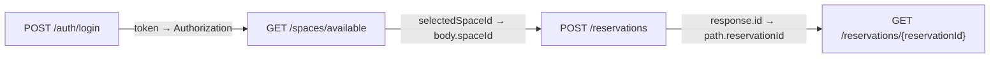

# 端到端範例：空間預約流程

> 狀態：Canonical MVP Example  
> 文件版本：0.1.0  
> 最後更新：2026-09-01  
> 用途：產品展示、整合測試、驗收與文件範例

## 1. 情境

使用者登入後查詢可預約空間，建立預約，再以回傳的 ID 查詢同一筆預約。

```text
POST /auth/login
  response.token
        ↓ Authorization: Bearer …
GET /spaces/available
  response[0].id
        ↓ requestBody.spaceId
POST /reservations
  response.id
        ↓ path.reservationId
GET /reservations/{reservationId}
```

這個範例刻意包含：

- 認證值傳遞；
- Array Response 選取；
- Body Mapping；
- CRUD Stateful Mock；
- Path Mapping；
- 404 與 429 Fault；
- Arazzo 匯入/匯出；
- Live Trace；
- Secret Redaction。

## 2. 最小 OpenAPI 摘要

```yaml
openapi: 3.1.0
info:
  title: Reservation API
  version: 1.0.0
servers:
  - url: http://127.0.0.1:4010

paths:
  /auth/login:
    post:
      operationId: login
      requestBody:
        required: true
        content:
          application/json:
            schema:
              type: object
              required: [username, password]
              properties:
                username: { type: string }
                password: { type: string, format: password }
      responses:
        "200":
          description: Authenticated
          content:
            application/json:
              schema:
                type: object
                required: [token]
                properties:
                  token: { type: string }

  /spaces/available:
    get:
      operationId: listAvailableSpaces
      security:
        - bearerAuth: []
      responses:
        "200":
          description: Available spaces
          content:
            application/json:
              schema:
                type: array
                items:
                  $ref: "#/components/schemas/Space"

  /reservations:
    post:
      operationId: createReservation
      security:
        - bearerAuth: []
      requestBody:
        required: true
        content:
          application/json:
            schema:
              type: object
              required: [spaceId, startsAt, endsAt]
              properties:
                spaceId: { type: string }
                startsAt: { type: string, format: date-time }
                endsAt: { type: string, format: date-time }
      responses:
        "201":
          description: Created
          content:
            application/json:
              schema:
                $ref: "#/components/schemas/Reservation"
        "429":
          description: Too many requests

  /reservations/{reservationId}:
    get:
      operationId: getReservation
      security:
        - bearerAuth: []
      parameters:
        - name: reservationId
          in: path
          required: true
          schema: { type: string }
      responses:
        "200":
          description: Found
          content:
            application/json:
              schema:
                $ref: "#/components/schemas/Reservation"
        "404":
          description: Not found

components:
  securitySchemes:
    bearerAuth:
      type: http
      scheme: bearer
  schemas:
    Space:
      type: object
      required: [id, name]
      properties:
        id: { type: string }
        name: { type: string }
    Reservation:
      type: object
      required: [id, spaceId, status, startsAt, endsAt]
      properties:
        id: { type: string }
        spaceId: { type: string }
        status:
          type: string
          enum: [pending, confirmed, cancelled]
        startsAt: { type: string, format: date-time }
        endsAt: { type: string, format: date-time }
```

完整 Example Repo 應將 Schema 拆成可測試檔案，但此摘要足以說明流程。

## 3. 匯入後的 Normalized Operations

| Operation Key | Method | Path | Inputs | Outputs |
|---|---|---|---|---|
| `login` | POST | `/auth/login` | username/password | token |
| `listAvailableSpaces` | GET | `/spaces/available` | bearer auth | `Space[]` |
| `createReservation` | POST | `/reservations` | bearer auth、spaceId、time | Reservation |
| `getReservation` | GET | `/reservations/{reservationId}` | bearer auth、reservationId | Reservation |

## 4. 推導候選

### C-001：登入 Token 傳遞

```yaml
candidateId: cand-auth-login-list-spaces
source:
  operation: login
  pointer: response.200.body#/token
target:
  operation: listAvailableSpaces
  location: header
  name: Authorization
mapping:
  template: "Bearer {$source}"
score: 0.96
confidence: high
evidence:
  - rule: security-propagation
    weight: 0.55
    detail: Target declares bearerAuth.
  - rule: token-semantic-name
    weight: 0.25
    detail: Source field name is token.
  - rule: success-response
    weight: 0.16
    detail: Value comes from a 2xx response.
status: candidate
```

系統也應提出相同 Token 至其他受保護 Operations 的 Candidate，但畫布可將它們視為共用 Auth Context，避免畫面過度連線。

### C-002：Space ID 至建立預約

```yaml
source: listAvailableSpaces.response.200.body#/0/id
target: createReservation.request.body#/spaceId
score: 0.82
confidence: medium
evidence:
  - normalized-name: id -> spaceId
  - schema-compatible: string -> string
  - resource-context: Space -> reservation.spaceId
ambiguity:
  - Array element selection requires user confirmation.
```

因為要從陣列選擇元素，不得自動接受。Inspector 應讓使用者改成以 Workflow Input `selectedSpaceId`，或明確使用第一筆只做 Demo。

### C-003：Reservation ID 至查詢路徑

```yaml
source: createReservation.response.201.body#/id
target: getReservation.path#/reservationId
score: 0.94
confidence: high
evidence:
  - resource-lifecycle: POST /reservations -> GET /reservations/{id}
  - normalized-name: id -> reservationId
  - schema-compatible: string -> string
```

即使是 High，仍保持 Candidate，直到使用者按 Accept。

## 5. Accepted Workflow

建議正式匯出：

```yaml
arazzo: 1.1.0
info:
  title: Reservation workflow
  version: 1.0.0

sourceDescriptions:
  - name: reservationApi
    type: openapi
    url: ./openapi.yaml

workflows:
  - workflowId: createAndReadReservation
    summary: Log in, select an available space, create a reservation, and read it back.
    inputs:
      type: object
      required:
        - username
        - password
        - selectedSpaceId
        - startsAt
        - endsAt
      properties:
        username: { type: string }
        password: { type: string, format: password }
        selectedSpaceId: { type: string }
        startsAt: { type: string, format: date-time }
        endsAt: { type: string, format: date-time }

    steps:
      - stepId: login
        operationId: login
        requestBody:
          contentType: application/json
          payload:
            username: $inputs.username
            password: $inputs.password
        successCriteria:
          - condition: $statusCode == 200
        outputs:
          token: $response.body#/token

      - stepId: listSpaces
        operationId: listAvailableSpaces
        parameters:
          - name: Authorization
            in: header
            value: Bearer {$steps.login.outputs.token}
        successCriteria:
          - condition: $statusCode == 200

      - stepId: createReservation
        operationId: createReservation
        parameters:
          - name: Authorization
            in: header
            value: Bearer {$steps.login.outputs.token}
        requestBody:
          contentType: application/json
          payload:
            spaceId: $inputs.selectedSpaceId
            startsAt: $inputs.startsAt
            endsAt: $inputs.endsAt
        successCriteria:
          - condition: $statusCode == 201
        outputs:
          reservationId: $response.body#/id

      - stepId: readReservation
        operationId: getReservation
        parameters:
          - name: Authorization
            in: header
            value: Bearer {$steps.login.outputs.token}
          - name: reservationId
            in: path
            value: $steps.createReservation.outputs.reservationId
        successCriteria:
          - condition: $statusCode == 200
        outputs:
          reservation: $response.body

    outputs:
      reservation: $steps.readReservation.outputs.reservation
```

實作時必須以 Arazzo 1.1 Validator 與本專案 Execution Profile 驗證這份 Fixture；若正式規格語法要求調整，以規格與 Conformance Test 為準。

## 6. Mock 設定

```yaml
version: 1

mock:
  seed: 240901
  sessions:
    selector:
      header: X-Schema-Flow-Session

  resources:
    - id: spaces
      collectionPath: /spaces/available
      idField: id
      seed:
        - id: room-a101
          name: A101 Meeting Room
        - id: room-b202
          name: B202 Workshop Room

    - id: reservations
      collectionPath: /reservations
      itemPath: /reservations/{reservationId}
      idField: id
      generatedDefaults:
        status: pending
      notFoundStatus: 404

  auth:
    loginOperationId: login
    generatedToken: demo-token

  faults:
    - id: create-rate-limit-once
      operationId: createReservation
      when:
        attempt: 1
      response:
        status: 429
        headers:
          Retry-After: "0"
      consume: once
```

## 7. Mock 狀態演進

### 初始

```json
{
  "spaces": {
    "room-a101": {
      "id": "room-a101",
      "name": "A101 Meeting Room"
    }
  },
  "reservations": {}
}
```

### `POST /reservations`

Request：

```json
{
  "spaceId": "room-a101",
  "startsAt": "2026-09-02T02:00:00Z",
  "endsAt": "2026-09-02T03:00:00Z"
}
```

第二次 Attempt 成功後：

```json
{
  "id": "res-0001",
  "spaceId": "room-a101",
  "status": "pending",
  "startsAt": "2026-09-02T02:00:00Z",
  "endsAt": "2026-09-02T03:00:00Z"
}
```

Store：

```json
{
  "reservations": {
    "res-0001": {
      "id": "res-0001",
      "spaceId": "room-a101",
      "status": "pending",
      "startsAt": "2026-09-02T02:00:00Z",
      "endsAt": "2026-09-02T03:00:00Z"
    }
  }
}
```

### `GET /reservations/res-0001`

必須回傳同一筆資料，不得重新 Faker 一筆不同內容。

## 8. Live Trace

```text
Run createAndReadReservation                    SUCCEEDED
Session demo-reservation-001                    Seed 240901

1. login                    200   42 ms   1 attempt
   output.token             [REDACTED]

2. listSpaces               200   18 ms   1 attempt
   response.items           2

3. createReservation        201   61 ms   2 attempts
   attempt 1                429   fault:create-rate-limit-once
   attempt 2                201
   state mutation           reservations + res-0001
   output.reservationId     res-0001

4. readReservation          200   15 ms   1 attempt
   path.reservationId       <- createReservation.reservationId
```

動畫只是補充；Trace Table 必須能用鍵盤閱讀與複製。

## 9. Mermaid Export



## 10. 驗收條件

- OpenAPI 可在無網路環境匯入；
- 四個 Operations 與 Schema Inspector 正確；
- 三類 Mapping 具 Evidence；
- 未接受 Candidate 不進入 Arazzo Export；
- Accepted Workflow 可通過 Validator；
- Mock 第一次 Create 回 429、第二次成功；
- 只有一次 State Mutation；
- Read Step 取得剛建立的 Entity；
- Token 在 UI、CLI、Log、Run Report 與 Snapshot 均已遮罩；
- 相同 Seed 與 Inputs 的 Run Report 除時間欄位外 Deterministic；
- Fastify Adapter 必須通過；MSW Adapter 若進入 MVP，結果一致；
- Keyboard-only 可完成整個流程。

## 11. Demo 劇本

1. 終端輸入 `schema-flow open examples/reservation/openapi.yaml`；
2. 拓撲自動出現；
3. 點擊 Candidate 查看 Evidence；
4. Accept Token 與 Reservation ID，將 Space 選擇改成 Input；
5. 啟動 Mock Session；
6. 執行 Workflow，看見 429→Retry→201；
7. 顯示 POST 建立資料被 GET 讀回；
8. Export Arazzo 與 Mermaid；
9. 結尾顯示：「OpenAPI tells you the endpoints. API Schema Flow lets you run the workflow before the backend exists.」
